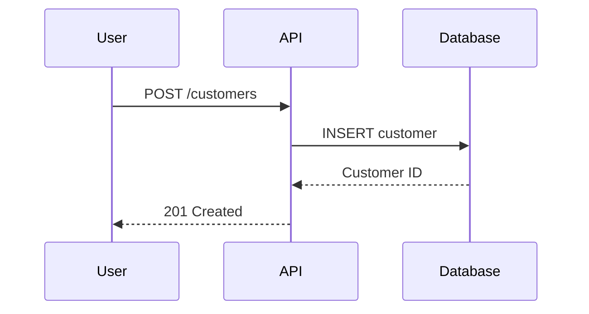

# Architecture Diagram Standards

**Version:** 1.0.0
**Source:** Enhanced Context MCP

## Overview

Use a two-tier approach based on complexity:

| Tool | Use Case | Output |
|------|----------|--------|
| **Mermaid** | Simple diagrams (flowcharts, sequence, ER) | Inline markdown rendering |
| **D2** | Complex architecture diagrams | PNG/SVG images |

## When to Use Which

| Diagram Type | Tool | Reason |
|--------------|------|--------|
| Sequence diagrams | Mermaid | Native markdown support |
| Simple flowcharts | Mermaid | Quick, inline rendering |
| System architecture | D2 | Better layout, icons, styling |
| Infrastructure diagrams | D2 | Cloud icons, complex connections |
| Database schemas | Mermaid (ER) | Simple entity relationships |
| Complex ER with details | D2 | Better control over layout |

## Storage Convention

```
docs/
├── diagrams/
│   ├── src/                    # Source files
│   │   ├── architecture.d2
│   │   ├── data-flow.d2
│   │   └── sequence.mmd
│   └── images/                 # Generated images
│       ├── architecture.png
│       ├── data-flow.png
│       └── sequence.png
```

## Workflow

1. Write diagram code (Mermaid or D2)
2. For D2: Generate image using CLI
3. Embed image in documentation
4. Keep source file in repo for future edits

## D2 Commands

```bash
# Install D2
brew install d2  # macOS
# or
curl -fsSL https://d2lang.com/install.sh | sh

# Generate PNG (default)
d2 input.d2 output.png

# Generate SVG (scalable)
d2 input.d2 output.svg

# With specific theme
d2 --theme 200 input.d2 output.png

# With layout engine (dagre, elk, tala)
d2 --layout elk input.d2 output.png
```

## Example D2 Diagram

```d2
# architecture.d2
direction: right

user: User {
  shape: person
}

web: Web UI {
  shape: rectangle
  style.fill: "#e1f5fe"
}

api: API Server {
  shape: rectangle
  style.fill: "#fff3e0"
}

db: PostgreSQL {
  shape: cylinder
  style.fill: "#e8f5e9"
}

user -> web: HTTPS
web -> api: REST/WebSocket
api -> db: SQL
```

## Embedding in Documentation

```markdown
## System Architecture


*Source: [architecture.d2](./diagrams/src/architecture.d2)*
```

## Mermaid Example


