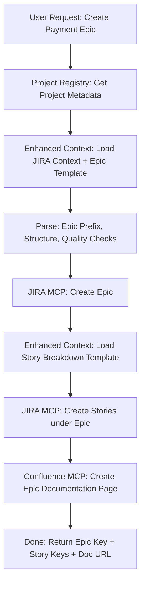
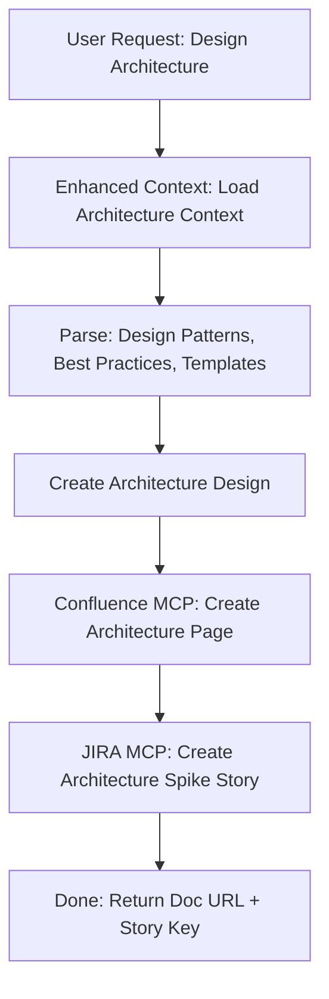
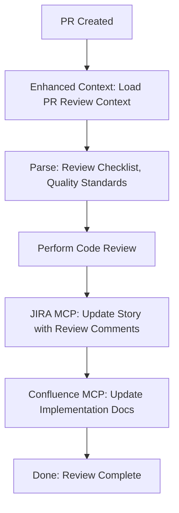
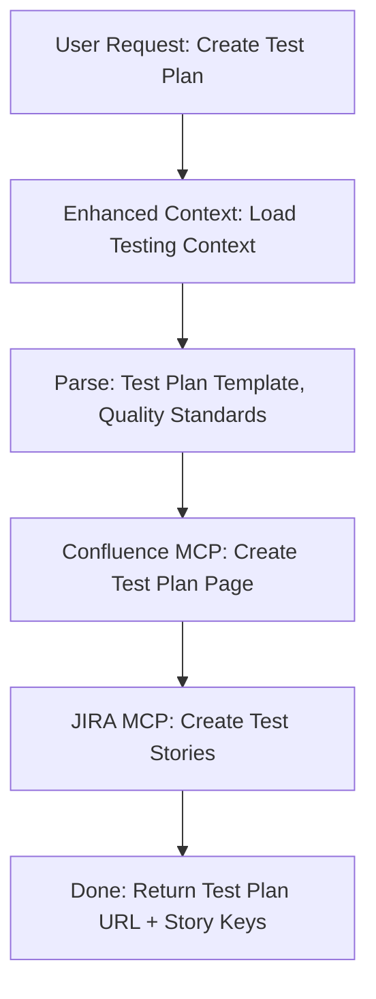

# VISHKAR MCP Integration Guide

**Version**: 2.0
**Last Updated**: October 24, 2025
**Environment**: Production (Vercel)

This guide explains how Vishkar should integrate with the four MCP servers deployed on Vercel for enhanced workflow automation.

---

## Table of Contents

1. [Overview](#overview)
2. [Project Registry MCP](#project-registry-mcp)
3. [Enhanced Context MCP](#enhanced-context-mcp)
4. [JIRA MCP](#jira-mcp)
5. [Confluence MCP](#confluence-mcp)
6. [Integration Workflows](#integration-workflows)
7. [Error Handling](#error-handling)
8. [Best Practices](#best-practices)

---

## Overview

### Available MCP Servers

| Server | Purpose | URL |
|--------|---------|-----|
| **Project Registry** | Project metadata storage and retrieval | `https://project-registry-henna.vercel.app` |
| **Enhanced Context** | Intelligent context/template/agent selection | `https://enhanced-context-mcp.vercel.app` (TBD) |
| **JIRA MCP** | JIRA integration for stories/epics | `https://jira-mcp.vercel.app` (TBD) |
| **Confluence MCP** | Confluence documentation management | `https://confluence-mcp.vercel.app` (TBD) |

### Authentication

All servers require an API key:
```http
X-API-Key: <your-api-key>
```

**Note**: The Project Registry uses token-based authentication. Other servers will use project-specific API keys from the registry.

---

## Project Registry MCP

### Purpose
Central registry for all projects with metadata, API keys, and configuration.

### Base URL
```
https://project-registry-henna.vercel.app
```

### Authentication
```http
Authorization: Bearer <admin-token>
```

For queries (no auth required):
```http
# No auth needed for GET requests
```

### Available Tools

#### 1. List All Projects
**Endpoint**: `GET /api/projects`

**Request**:
```bash
curl https://project-registry-henna.vercel.app/api/projects
```

**Response**:
```json
{
  "success": true,
  "projects": [
    {
      "id": "proj_123",
      "name": "MyProject",
      "description": "Project description",
      "jiraProjectKey": "MYPROJ",
      "confluenceSpaceKey": "MYSP",
      "apiKey": "encrypted_key",
      "createdAt": "2025-10-24T00:00:00.000Z",
      "updatedAt": "2025-10-24T00:00:00.000Z"
    }
  ]
}
```

#### 2. Get Project by ID
**Endpoint**: `GET /api/projects/:id`

**Request**:
```bash
curl https://project-registry-henna.vercel.app/api/projects/proj_123
```

**Response**:
```json
{
  "success": true,
  "project": {
    "id": "proj_123",
    "name": "MyProject",
    "description": "Project description",
    "jiraProjectKey": "MYPROJ",
    "confluenceSpaceKey": "MYSP",
    "githubRepo": "owner/repo",
    "apiKey": "encrypted_key"
  }
}
```

#### 3. Create New Project
**Endpoint**: `POST /api/projects`

**Request**:
```bash
curl -X POST https://project-registry-henna.vercel.app/api/projects \
  -H "Authorization: Bearer <admin-token>" \
  -H "Content-Type: application/json" \
  -d '{
    "name": "NewProject",
    "description": "A new project",
    "jiraProjectKey": "NEWPROJ",
    "confluenceSpaceKey": "NEWSP",
    "githubRepo": "owner/new-repo"
  }'
```

**Response**:
```json
{
  "success": true,
  "project": {
    "id": "proj_456",
    "name": "NewProject",
    "apiKey": "generated_secure_key",
    "createdAt": "2025-10-24T00:00:00.000Z"
  }
}
```

#### 4. Update Project
**Endpoint**: `PUT /api/projects/:id`

**Request**:
```bash
curl -X PUT https://project-registry-henna.vercel.app/api/projects/proj_123 \
  -H "Authorization: Bearer <admin-token>" \
  -H "Content-Type: application/json" \
  -d '{
    "description": "Updated description",
    "jiraProjectKey": "UPDATED"
  }'
```

#### 5. Delete Project
**Endpoint**: `DELETE /api/projects/:id`

**Request**:
```bash
curl -X DELETE https://project-registry-henna.vercel.app/api/projects/proj_123 \
  -H "Authorization: Bearer <admin-token>"
```

#### 6. Validate API Token
**Endpoint**: `POST /api/validate-token`

**Request**:
```bash
curl -X POST https://project-registry-henna.vercel.app/api/validate-token \
  -H "Authorization: Bearer <token-to-validate>"
```

**Response**:
```json
{
  "valid": true,
  "message": "Token is valid"
}
```

### When Vishkar Should Use This

1. **Before any workflow**: Get project metadata (JIRA key, Confluence space, API key)
2. **Project setup**: Create new project entries
3. **Configuration updates**: Update project settings
4. **API key validation**: Verify tokens before making requests

---

## Enhanced Context MCP

### Purpose
Intelligent context, template, and agent selection based on task intent, scope, and complexity.

### Base URL
```
https://enhanced-context-mcp.vercel.app/api/mcp
```

### Authentication
```http
X-API-Key: <project-api-key>
```

### Available Tools

#### 1. Load Enhanced Context (Primary Tool)
**Endpoint**: `POST /api/mcp`

**Tool Name**: `load_enhanced_context`

**Request**:
```json
{
  "tool": "load_enhanced_context",
  "arguments": {
    "query_type": "story",
    "task_intent": "create",
    "scope": "epic",
    "complexity": "complex",
    "domain_focus": ["security", "payments"],
    "output_format": "jira",
    "include_sdlc_checks": true,
    "project_path": "/path/to/project",
    "user_query": "Create a payment processing epic with security requirements"
  }
}
```

**Parameters**:
- `query_type` (required): One of `story`, `architecture`, `testing`, `pr`, `infrastructure`, `documentation`
- `task_intent`: `create`, `refine`, `breakdown`, `review`, `plan`, `implement`
- `scope`: `epic`, `story`, `subtask`, `portfolio`, `theme`, `spike`
- `complexity`: `simple`, `medium`, `complex`, `critical`
- `domain_focus`: Array of `security`, `payments`, `compliance`, `performance`, `accessibility`, `data`, `infrastructure`, `api`, `frontend`, `backend`
- `output_format`: `jira`, `confluence`, `github`, `gitlab`
- `include_sdlc_checks`: Boolean (default: false)
- `project_path`: Optional project directory path
- `user_query`: Optional original user query for semantic understanding

**Response**:
```json
{
  "success": true,
  "tool": "load_enhanced_context",
  "result": {
    "content": [
      {
        "type": "text",
        "text": "# Enhanced Context Loaded Successfully\n\n## 🎯 Task Understanding\n\n**Query Type**: story\n**Task Intent**: create\n**Scope**: epic\n**Complexity**: complex\n**Domain Focus**: security, payments\n\n**Context Combination**: Create Complex Epic\n**Reasoning**: Selected combination: Create Complex Epic...\n\n## 📋 Current SDLC Step\n\n**Step 1**: Epic/Story Creation...\n\n## 📚 Task Guidance\n\n**Epic Prefix Format**: PROJECT-EPIC-###\n**Story Structure**: As a [user type], I want [functionality], so that [business value]\n\n**Quality Checks**:\n- Epic has clear business value statement\n- Epic is scoped to deliverable increment\n- Technical dependencies identified\n\n**Common Mistakes to Avoid**:\n- ⚠️ Epic too large (should be deliverable within 1-2 sprints)\n- ⚠️ Missing acceptance criteria\n\n**Best Practices**:\n- ✨ Start with user outcome, not technical solution\n- ✨ Include success metrics\n\n## 🤖 Auto-Selected Agent: Project Manager\n\n### Complete Persona:\n[Agent content here]\n\n## 📋 Templates Loaded (1)\n**Available Templates**: t-epic-specification\n\n## 🌍 Loaded Contexts (4)\n\n## c-core-sdlc\n**Reason**: Base context for story creation\n[Context content]\n\n## c-jira-management\n**Reason**: Base context for JIRA output\n[Context content]\n\n## c-architecture-generation\n**Reason**: Complex epics require architectural planning\n[Context content]\n\n## c-security-review\n**Reason**: Domain focus includes security\n[Context content]\n\n## 📝 VISHKAR Templates:\n\n## 📝 Template: t-epic-specification\n[Template content]\n\n## 📊 Complete 13-Step SDLC Checklist\n\n➡️ **Step 1: Epic/Story Creation**\nCreate epic or user story in Jira with proper format and structure\nChecks: Epic has proper prefix format (e.g., PROJECT-EPIC-###), Clear business value statement included, Acceptance criteria defined in Given/When/Then format, Epic is appropriately scoped (deliverable in 1-2 sprints)\n\n**Step 2: Story Breakdown**\n...\n\n## 📊 Summary:\n- Context Combination: Create Complex Epic\n- Loaded 4 contexts (2 base + 2 conditional)\n- Loaded 1 templates: t-epic-specification\n- Loaded 0 project-specific rules\n- Agent: Project Manager (auto-selected)\n- Available agents: 2 specialists\n- Current SDLC Step: 1. Epic/Story Creation\n- Intelligent context selection enabled with task-aware combinations\n"
      }
    ],
    "reasoning": "Selected combination: Create Complex Epic\nReason: Matches query type 'story' with intent 'create' and scope 'epic'\nTask intent: create\nScope: epic\nComplexity: complex\nDomain focus: security, payments\nConditional contexts loaded:\n  - c-architecture-generation (Reason: Complex epics require architectural planning)\n  - c-security-review (Reason: Domain focus includes security)",
    "guidance": {
      "epicPrefixRequired": true,
      "epicPrefixFormat": "PROJECT-EPIC-###",
      "storyStructure": "As a [user type], I want [functionality], so that [business value]",
      "acceptanceCriteriaFormat": "Given/When/Then",
      "qualityChecks": [
        "Epic has clear business value statement",
        "Epic is scoped to deliverable increment",
        "Epic has defined acceptance criteria",
        "Technical dependencies identified"
      ],
      "commonMistakes": [
        "Epic too large (should be deliverable within 1-2 sprints)",
        "Missing acceptance criteria",
        "No technical dependencies identified"
      ],
      "bestPractices": [
        "Start with user outcome, not technical solution",
        "Include success metrics",
        "Link to business theme/objective"
      ],
      "prerequisites": [
        "Business value clearly defined",
        "Stakeholder alignment on scope"
      ],
      "dependencies": []
    },
    "sdlcChecklist": [
      {
        "step": 1,
        "name": "Epic/Story Creation",
        "status": "current",
        "description": "Create epic or user story in Jira with proper format and structure",
        "checks": [
          {
            "id": "epic-prefix",
            "description": "Epic has proper prefix format (e.g., PROJECT-EPIC-###)",
            "status": "incomplete",
            "severity": "required",
            "automatable": true
          }
        ],
        "artifacts": ["Epic in Jira", "Business value statement", "Acceptance criteria"],
        "nextSteps": ["Break down epic into user stories", "Identify technical dependencies"]
      }
    ],
    "currentStep": {
      "step": 1,
      "name": "Epic/Story Creation",
      "status": "current",
      "description": "Create epic or user story in Jira with proper format and structure"
    }
  }
}
```

**Response Structure**:
- `content[0].text`: Complete formatted response with all contexts, templates, agent persona, guidance, SDLC checklist
- `reasoning`: Explanation of why this combination was selected
- `guidance`: Structured task guidance (quality checks, mistakes to avoid, best practices)
- `sdlcChecklist`: All 13 SDLC steps (if requested)
- `currentStep`: Current SDLC step based on task_intent

#### 2. List Available Agents
**Tool Name**: `list_vishkar_agents`

**Request**:
```json
{
  "tool": "list_vishkar_agents",
  "arguments": {
    "agent_type": "all"
  }
}
```

**Parameters**:
- `agent_type`: `domain_expert`, `technical`, or `all` (default: `all`)

#### 3. Load Specific Agent
**Tool Name**: `load_vishkar_agent`

**Request**:
```json
{
  "tool": "load_vishkar_agent",
  "arguments": {
    "agent_id": "backend-engineer",
    "include_examples": true
  }
}
```

#### 4. Update Agent (Learning)
**Tool Name**: `update_agent`

**Request**:
```json
{
  "tool": "update_agent",
  "arguments": {
    "agent_name": "backend-engineer",
    "operation": "enhance",
    "agent_data": {
      "name": "Backend Engineer",
      "description": "Updated description",
      "content": "Updated agent content"
    },
    "learning_notes": "Improved based on successful payment gateway implementation"
  }
}
```

### When Vishkar Should Use This

**Always use as the FIRST step in any workflow:**

1. **Story/Epic Creation**: Get JIRA context, templates, epic prefix format, quality checks
2. **Architecture Planning**: Get architecture contexts, templates, design patterns
3. **Testing**: Get testing contexts, test plan templates, quality standards
4. **Code Review**: Get PR review contexts, code quality standards
5. **Infrastructure**: Get IaC contexts, Terraform templates, cloud best practices
6. **Documentation**: Get Confluence contexts, documentation templates

**Key Insight**: Enhanced Context provides the KNOWLEDGE for the work to be done, regardless of project characteristics.

### Context Combination Examples

#### Example 1: Create Complex Epic
```json
{
  "query_type": "story",
  "task_intent": "create",
  "scope": "epic",
  "complexity": "complex"
}
```
→ Loads: c-core-sdlc, c-jira-management, c-architecture-generation, c-project-management

#### Example 2: Breakdown Existing Epic
```json
{
  "query_type": "story",
  "task_intent": "breakdown",
  "scope": "epic"
}
```
→ Loads: c-core-sdlc, c-jira-management, t-story-breakdown template

#### Example 3: Create Architecture with Security
```json
{
  "query_type": "architecture",
  "task_intent": "create",
  "complexity": "critical",
  "domain_focus": ["security", "infrastructure"]
}
```
→ Loads: c-architecture-generation, c-cloud-data-engineering, c-security-review, c-infrastructure-as-code

---

## JIRA MCP

### Purpose
Create, update, and manage JIRA issues (epics, stories, subtasks) with full JIRA API integration.

### Base URL
```
https://jira-mcp.vercel.app/api/mcp
```

### Authentication
```http
X-API-Key: <project-api-key>
```

### Available Tools

#### 1. Create Issue
**Tool Name**: `create_issue`

**Request**:
```json
{
  "tool": "create_issue",
  "arguments": {
    "project_key": "MYPROJ",
    "issue_type": "Epic",
    "summary": "MYPROJ-EPIC-001: Payment Processing System",
    "description": "As a business owner, I want a secure payment processing system, so that customers can purchase products safely.\n\n## Business Value\n- Enable online transactions\n- Increase revenue by 25%\n- Improve customer trust\n\n## Acceptance Criteria\n**Given** a customer is on the checkout page\n**When** they enter valid payment information\n**Then** the payment should be processed securely\n\n**Given** a payment fails\n**When** the customer is notified\n**Then** they should see a clear error message with retry option",
    "priority": "High",
    "labels": ["payments", "security", "epic"],
    "epic_name": "Payment Processing System",
    "custom_fields": {
      "story_points": 40
    }
  }
}
```

**Parameters**:
- `project_key` (required): JIRA project key (from Project Registry)
- `issue_type` (required): `Epic`, `Story`, `Task`, `Subtask`, `Bug`
- `summary` (required): Issue title (use epic prefix format if applicable)
- `description`: Detailed description (supports Markdown/JIRA wiki)
- `priority`: `Highest`, `High`, `Medium`, `Low`, `Lowest`
- `labels`: Array of labels
- `assignee`: JIRA username
- `parent_key`: Parent issue key (for subtasks)
- `epic_link`: Epic key (for stories under an epic)
- `epic_name`: Epic name (for Epic issue type)
- `custom_fields`: Object with custom field values

**Response**:
```json
{
  "success": true,
  "tool": "create_issue",
  "result": {
    "key": "MYPROJ-1234",
    "id": "10234",
    "self": "https://your-domain.atlassian.net/rest/api/3/issue/10234",
    "url": "https://your-domain.atlassian.net/browse/MYPROJ-1234"
  }
}
```

#### 2. Update Issue
**Tool Name**: `update_issue`

**Request**:
```json
{
  "tool": "update_issue",
  "arguments": {
    "issue_key": "MYPROJ-1234",
    "summary": "Updated title",
    "description": "Updated description",
    "status": "In Progress",
    "assignee": "john.doe",
    "labels": ["updated", "payments"],
    "custom_fields": {
      "story_points": 50
    }
  }
}
```

#### 3. Get Issue
**Tool Name**: `get_issue`

**Request**:
```json
{
  "tool": "get_issue",
  "arguments": {
    "issue_key": "MYPROJ-1234",
    "fields": ["summary", "description", "status", "assignee", "labels"]
  }
}
```

#### 4. Search Issues
**Tool Name**: `search_issues`

**Request**:
```json
{
  "tool": "search_issues",
  "arguments": {
    "jql": "project = MYPROJ AND type = Epic AND status = 'To Do'",
    "max_results": 50,
    "fields": ["summary", "description", "status", "created"]
  }
}
```

**Common JQL Queries**:
```jql
// All epics in a project
project = MYPROJ AND type = Epic

// Stories under an epic
"Epic Link" = MYPROJ-1234

// Open issues assigned to me
project = MYPROJ AND assignee = currentUser() AND status != Done

// Recently created issues
project = MYPROJ AND created >= -7d

// High priority bugs
project = MYPROJ AND type = Bug AND priority = High
```

#### 5. Add Comment
**Tool Name**: `add_comment`

**Request**:
```json
{
  "tool": "add_comment",
  "arguments": {
    "issue_key": "MYPROJ-1234",
    "comment": "Implementation completed. Ready for QA testing.\n\n*Test coverage*: 85%\n*Performance*: All endpoints < 200ms"
  }
}
```

#### 6. Link Issues
**Tool Name**: `link_issues`

**Request**:
```json
{
  "tool": "link_issues",
  "arguments": {
    "inward_issue": "MYPROJ-1234",
    "outward_issue": "MYPROJ-5678",
    "link_type": "blocks"
  }
}
```

**Link Types**: `blocks`, `depends on`, `relates to`, `duplicates`, `causes`

#### 7. Transition Issue
**Tool Name**: `transition_issue`

**Request**:
```json
{
  "tool": "transition_issue",
  "arguments": {
    "issue_key": "MYPROJ-1234",
    "transition_name": "In Progress"
  }
}
```

**Common Transitions**: `To Do`, `In Progress`, `In Review`, `Done`, `Blocked`

### When Vishkar Should Use This

1. **After getting Enhanced Context**: Use the epic prefix format and structure from guidance
2. **Creating epics**: Use `create_issue` with `issue_type: "Epic"` and proper epic name
3. **Creating stories**: Link to parent epic using `epic_link`
4. **Creating subtasks**: Link to parent story using `parent_key`
5. **Updating progress**: Use `transition_issue` and `add_comment`
6. **Querying status**: Use `search_issues` with JQL

### Best Practices for JIRA Integration

1. **Epic Prefix Format**: Always use format from Enhanced Context guidance (e.g., `PROJECT-EPIC-001`)
2. **Description Format**: Use structured format with Business Value, Acceptance Criteria (Given/When/Then)
3. **Labels**: Add relevant domain focus labels from Enhanced Context (e.g., `security`, `payments`)
4. **Story Points**: Estimate based on complexity from Enhanced Context
5. **Linking**: Always link stories to epics, subtasks to stories

---

## Confluence MCP

### Purpose
Create, update, and manage Confluence documentation pages with full Confluence API integration.

### Base URL
```
https://confluence-mcp.vercel.app/api/mcp
```

### Authentication
```http
X-API-Key: <project-api-key>
```

### Available Tools

#### 1. Create Page
**Tool Name**: `create_page`

**Request**:
```json
{
  "tool": "create_page",
  "arguments": {
    "space_key": "MYSP",
    "title": "Payment Processing System - Technical Architecture",
    "content": "<h1>Payment Processing System</h1>\n<p>This document describes the technical architecture for the payment processing system.</p>\n<h2>System Overview</h2>\n<p>The system consists of three main components:</p>\n<ul>\n<li>Payment Gateway Integration</li>\n<li>Transaction Processing Engine</li>\n<li>Fraud Detection System</li>\n</ul>",
    "parent_id": "12345678",
    "labels": ["architecture", "payments", "security"]
  }
}
```

**Parameters**:
- `space_key` (required): Confluence space key (from Project Registry)
- `title` (required): Page title
- `content` (required): Page content in Confluence storage format (HTML-like)
- `parent_id`: Parent page ID (for hierarchical pages)
- `labels`: Array of labels

**Response**:
```json
{
  "success": true,
  "tool": "create_page",
  "result": {
    "id": "87654321",
    "title": "Payment Processing System - Technical Architecture",
    "url": "https://your-domain.atlassian.net/wiki/spaces/MYSP/pages/87654321"
  }
}
```

#### 2. Update Page
**Tool Name**: `update_page`

**Request**:
```json
{
  "tool": "update_page",
  "arguments": {
    "page_id": "87654321",
    "title": "Updated Title",
    "content": "<h1>Updated Content</h1>",
    "version_comment": "Added security considerations section"
  }
}
```

#### 3. Get Page
**Tool Name**: `get_page`

**Request**:
```json
{
  "tool": "get_page",
  "arguments": {
    "page_id": "87654321",
    "expand": ["body.storage", "version", "metadata.labels"]
  }
}
```

#### 4. Search Pages
**Tool Name**: `search_pages`

**Request**:
```json
{
  "tool": "search_pages",
  "arguments": {
    "space_key": "MYSP",
    "cql": "type = page AND space = MYSP AND label = 'architecture'",
    "limit": 25
  }
}
```

**Common CQL Queries**:
```cql
// Pages with specific label
type = page AND space = MYSP AND label = 'architecture'

// Pages created recently
type = page AND space = MYSP AND created >= now('-7d')

// Pages by title
type = page AND space = MYSP AND title ~ 'Payment*'

// Pages modified by user
type = page AND space = MYSP AND contributor = 'john.doe'
```

#### 5. Upload Attachment
**Tool Name**: `upload_attachment`

**Request**:
```json
{
  "tool": "upload_attachment",
  "arguments": {
    "page_id": "87654321",
    "file_name": "architecture-diagram.png",
    "file_content": "<base64-encoded-content>",
    "comment": "System architecture diagram v2.0"
  }
}
```

#### 6. Add Comment
**Tool Name**: `add_page_comment`

**Request**:
```json
{
  "tool": "add_page_comment",
  "arguments": {
    "page_id": "87654321",
    "comment": "Please review the security section and provide feedback."
  }
}
```

### When Vishkar Should Use This

1. **After getting Enhanced Context**: Use Confluence templates and documentation structure
2. **Architecture documentation**: Create pages with diagrams and technical details
3. **Project planning**: Document project plans, roadmaps, requirements
4. **Knowledge base**: Create how-to guides, troubleshooting docs
5. **Meeting notes**: Document decisions, action items

### Content Format

Confluence uses storage format (similar to HTML). Common patterns:

```html
<!-- Headings -->
<h1>Main Heading</h1>
<h2>Subheading</h2>

<!-- Paragraphs -->
<p>This is a paragraph.</p>

<!-- Lists -->
<ul>
  <li>Item 1</li>
  <li>Item 2</li>
</ul>

<ol>
  <li>First</li>
  <li>Second</li>
</ol>

<!-- Code -->
<ac:structured-macro ac:name="code">
  <ac:parameter ac:name="language">javascript</ac:parameter>
  <ac:plain-text-body><![CDATA[
    const example = "code here";
  ]]></ac:plain-text-body>
</ac:structured-macro>

<!-- Tables -->
<table>
  <tr>
    <th>Header 1</th>
    <th>Header 2</th>
  </tr>
  <tr>
    <td>Cell 1</td>
    <td>Cell 2</td>
  </tr>
</table>

<!-- Links -->
<a href="https://example.com">Link text</a>

<!-- Status badges -->
<ac:structured-macro ac:name="status">
  <ac:parameter ac:name="title">In Progress</ac:parameter>
  <ac:parameter ac:name="color">Yellow</ac:parameter>
</ac:structured-macro>
```

---

## Integration Workflows

### Workflow 1: Create Epic with Stories



**Step-by-Step**:

1. **Get Project Metadata**:
```bash
GET https://project-registry-henna.vercel.app/api/projects/proj_123
```

2. **Load Enhanced Context**:
```json
{
  "tool": "load_enhanced_context",
  "arguments": {
    "query_type": "story",
    "task_intent": "create",
    "scope": "epic",
    "complexity": "complex",
    "domain_focus": ["payments", "security"],
    "output_format": "jira",
    "include_sdlc_checks": true
  }
}
```

3. **Extract Guidance**:
- Epic prefix format: `MYPROJ-EPIC-001`
- Story structure: `As a... I want... So that...`
- Quality checks: Business value, acceptance criteria, scope
- Common mistakes: Epic too large, missing criteria

4. **Create Epic in JIRA**:
```json
{
  "tool": "create_issue",
  "arguments": {
    "project_key": "MYPROJ",
    "issue_type": "Epic",
    "summary": "MYPROJ-EPIC-001: Payment Processing System",
    "description": "<structured description from template>",
    "epic_name": "Payment Processing System",
    "labels": ["payments", "security", "epic"],
    "priority": "High"
  }
}
```

5. **Load Story Breakdown Context**:
```json
{
  "tool": "load_enhanced_context",
  "arguments": {
    "query_type": "story",
    "task_intent": "breakdown",
    "scope": "epic",
    "complexity": "complex"
  }
}
```

6. **Create Stories**:
```json
{
  "tool": "create_issue",
  "arguments": {
    "project_key": "MYPROJ",
    "issue_type": "Story",
    "summary": "As a customer, I want to enter payment information securely",
    "description": "<structured from template>",
    "epic_link": "MYPROJ-1234",
    "labels": ["payments", "security"],
    "custom_fields": {
      "story_points": 8
    }
  }
}
```

7. **Create Documentation**:
```json
{
  "tool": "create_page",
  "arguments": {
    "space_key": "MYSP",
    "title": "MYPROJ-EPIC-001: Payment Processing System",
    "content": "<epic documentation from template>",
    "labels": ["epic", "payments", "architecture"]
  }
}
```

### Workflow 2: Architecture Design & Documentation



### Workflow 3: Code Review & Documentation



### Workflow 4: Testing & QA



---

## Error Handling

### Common Error Patterns

#### 1. Authentication Errors
```json
{
  "success": false,
  "error": "Authentication required. Provide X-API-Key header.",
  "status": 401
}
```

**Resolution**:
- Check API key is correct
- Verify key is from Project Registry
- Ensure key is not expired

#### 2. Project Not Found
```json
{
  "success": false,
  "error": "Project not found: proj_123",
  "status": 404
}
```

**Resolution**:
- Verify project ID is correct
- Check project exists in registry
- Ensure project hasn't been deleted

#### 3. Invalid JIRA Project Key
```json
{
  "success": false,
  "error": "JIRA project not found: INVALID",
  "status": 400
}
```

**Resolution**:
- Get correct project key from Project Registry
- Verify JIRA project exists
- Check JIRA connection configuration

#### 4. Confluence Space Not Found
```json
{
  "success": false,
  "error": "Confluence space not found: INVALID",
  "status": 404
}
```

**Resolution**:
- Get correct space key from Project Registry
- Verify Confluence space exists
- Check Confluence connection configuration

#### 5. Rate Limiting
```json
{
  "success": false,
  "error": "Rate limit exceeded. Try again later.",
  "status": 429,
  "retry_after": 60
}
```

**Resolution**:
- Wait for `retry_after` seconds
- Implement exponential backoff
- Reduce request frequency

### Error Handling Best Practices

1. **Always check `success` field**:
```javascript
const response = await callMCP(endpoint, data);
if (!response.success) {
  // Handle error
  console.error(response.error);
  // Retry logic or fallback
}
```

2. **Implement retry logic**:
```javascript
async function callWithRetry(fn, maxRetries = 3) {
  for (let i = 0; i < maxRetries; i++) {
    try {
      const result = await fn();
      if (result.success) return result;
    } catch (error) {
      if (i === maxRetries - 1) throw error;
      await sleep(Math.pow(2, i) * 1000); // Exponential backoff
    }
  }
}
```

3. **Validate before calling**:
```javascript
// Before JIRA call
const project = await getProject(projectId);
if (!project.jiraProjectKey) {
  throw new Error("JIRA project key not configured");
}

// Before Confluence call
if (!project.confluenceSpaceKey) {
  throw new Error("Confluence space key not configured");
}
```

---

## Best Practices

### 1. Always Start with Enhanced Context

```javascript
// ✅ CORRECT: Load context first
const context = await enhancedContext.loadContext({
  query_type: "story",
  task_intent: "create",
  scope: "epic",
  complexity: "complex"
});

// Extract guidance
const guidance = context.result.guidance;
const epicPrefix = guidance.epicPrefixFormat; // "PROJECT-EPIC-###"
const qualityChecks = guidance.qualityChecks;

// Now create JIRA epic with proper format
await jiraMCP.createIssue({
  summary: `${epicPrefix}: ${epicName}`,
  ...
});
```

```javascript
// ❌ WRONG: Creating epic without context
await jiraMCP.createIssue({
  summary: "Epic 1", // Missing prefix format
  description: "Some description" // No structured format
});
```

### 2. Use Project Registry for Configuration

```javascript
// ✅ CORRECT: Get configuration from registry
const project = await projectRegistry.getProject(projectId);
const apiKey = project.apiKey;
const jiraKey = project.jiraProjectKey;
const confluenceKey = project.confluenceSpaceKey;

// Use in subsequent calls
await jiraMCP.createIssue({
  project_key: jiraKey,
  ...
}, {
  headers: { 'X-API-Key': apiKey }
});
```

```javascript
// ❌ WRONG: Hardcoding configuration
const jiraKey = "MYPROJ"; // Hardcoded!
await jiraMCP.createIssue({ project_key: jiraKey, ... });
```

### 3. Follow SDLC Steps

```javascript
// ✅ CORRECT: Follow SDLC progression
// Step 1: Epic Creation
await loadContext({ task_intent: "create", scope: "epic" });
const epicKey = await createEpic();

// Step 2: Story Breakdown
await loadContext({ task_intent: "breakdown", scope: "epic" });
const storyKeys = await createStoriesForEpic(epicKey);

// Step 3: Technical Design
await loadContext({ task_intent: "plan", query_type: "architecture" });
await createArchitectureDoc(epicKey);

// Step 4: Implementation
await loadContext({ task_intent: "implement" });
// Development work...

// Step 8: Code Review
await loadContext({ task_intent: "review", query_type: "pr" });
// Review PR...
```

### 4. Link Related Items

```javascript
// ✅ CORRECT: Maintain relationships
// Create epic
const epicKey = await createEpic();

// Create stories linked to epic
const story1 = await createStory({ epic_link: epicKey });
const story2 = await createStory({ epic_link: epicKey });

// Create subtasks linked to story
const subtask1 = await createSubtask({ parent_key: story1 });

// Create Confluence page with references
await createPage({
  title: `${epicKey}: Documentation`,
  content: `Related JIRA Epic: ${epicKey}`
});
```

### 5. Use Structured Formats

```javascript
// ✅ CORRECT: Use formats from Enhanced Context
const context = await loadContext({ query_type: "story", task_intent: "create", scope: "epic" });
const guidance = context.result.guidance;

const description = `
${guidance.storyStructure}

## Business Value
${businessValue}

## Acceptance Criteria
${guidance.acceptanceCriteriaFormat}
**Given** ${given}
**When** ${when}
**Then** ${then}
`;

await createIssue({
  summary: `${guidance.epicPrefixFormat}: ${title}`,
  description
});
```

### 6. Add Quality Checks

```javascript
// ✅ CORRECT: Validate against quality checks
const context = await loadContext({ ... });
const qualityChecks = context.result.guidance.qualityChecks;

// Validate before creating
const validationErrors = [];
if (!epic.businessValue) {
  validationErrors.push("Missing: " + qualityChecks[0]); // "Epic has clear business value statement"
}
if (!epic.acceptanceCriteria) {
  validationErrors.push("Missing: " + qualityChecks[2]); // "Epic has defined acceptance criteria"
}

if (validationErrors.length > 0) {
  throw new Error("Quality validation failed:\n" + validationErrors.join("\n"));
}

// Proceed with creation
await createEpic(epic);
```

### 7. Handle Domain Focus

```javascript
// ✅ CORRECT: Specify domain focus for specialized contexts
const context = await loadContext({
  query_type: "story",
  task_intent: "create",
  complexity: "critical",
  domain_focus: ["security", "payments", "compliance"]
});

// This will load additional contexts:
// - c-security-review (for security domain)
// - c-payments-integration (for payments domain)
// - c-compliance-standards (for compliance domain)

// Use the additional guidance
const securityChecks = context.result.contexts.find(c => c.name === "c-security-review");
```

### 8. Track SDLC Progress

```javascript
// ✅ CORRECT: Use SDLC checklist for progress tracking
const context = await loadContext({
  query_type: "story",
  include_sdlc_checks: true
});

const currentStep = context.result.currentStep;
console.log(`Current SDLC Step: ${currentStep.step}. ${currentStep.name}`);

// Show required checks
currentStep.checks
  .filter(c => c.severity === "required")
  .forEach(check => {
    console.log(`- ${check.description}: ${check.status}`);
  });

// Show next steps
console.log("Next Steps:");
currentStep.nextSteps.forEach(step => console.log(`- ${step}`));
```

---

## Quick Reference

### Typical Workflow Sequence

1. **Project Setup**:
   ```
   Project Registry → Get project metadata (keys, config)
   ```

2. **Epic Creation**:
   ```
   Enhanced Context → Load epic context + template
   ↓
   JIRA MCP → Create epic with proper format
   ↓
   Confluence MCP → Create epic documentation
   ```

3. **Story Breakdown**:
   ```
   Enhanced Context → Load story breakdown context
   ↓
   JIRA MCP → Create stories linked to epic
   ```

4. **Architecture Design**:
   ```
   Enhanced Context → Load architecture context
   ↓
   Confluence MCP → Create architecture documentation
   ↓
   JIRA MCP → Create technical spike/design stories
   ```

5. **Implementation**:
   ```
   Enhanced Context → Load implementation context
   ↓
   Development work
   ↓
   JIRA MCP → Update story status, add comments
   ```

6. **Code Review**:
   ```
   Enhanced Context → Load PR review context
   ↓
   Review code against quality checks
   ↓
   JIRA MCP → Add review comments to story
   ```

7. **Testing**:
   ```
   Enhanced Context → Load testing context
   ↓
   Confluence MCP → Create test plan documentation
   ↓
   JIRA MCP → Create test stories
   ```

8. **Deployment & Closure**:
   ```
   JIRA MCP → Transition stories to Done
   ↓
   Confluence MCP → Update documentation with final notes
   ```

### Key URLs

| Service | URL |
|---------|-----|
| Project Registry | https://project-registry-henna.vercel.app |
| Enhanced Context | https://enhanced-context-mcp.vercel.app (TBD) |
| JIRA MCP | https://jira-mcp.vercel.app (TBD) |
| Confluence MCP | https://confluence-mcp.vercel.app (TBD) |

### Support

For issues or questions:
- Check VERCEL-BUILD-TROUBLESHOOTING.md
- Check VERCEL-DEPENDENCIES.md
- Review service-specific documentation

---

**End of Vishkar MCP Integration Guide**
