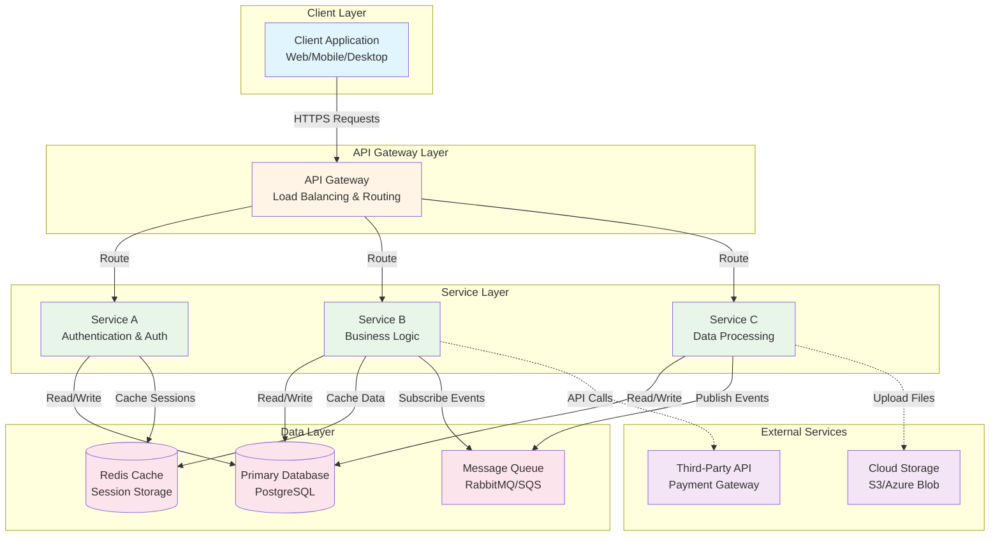
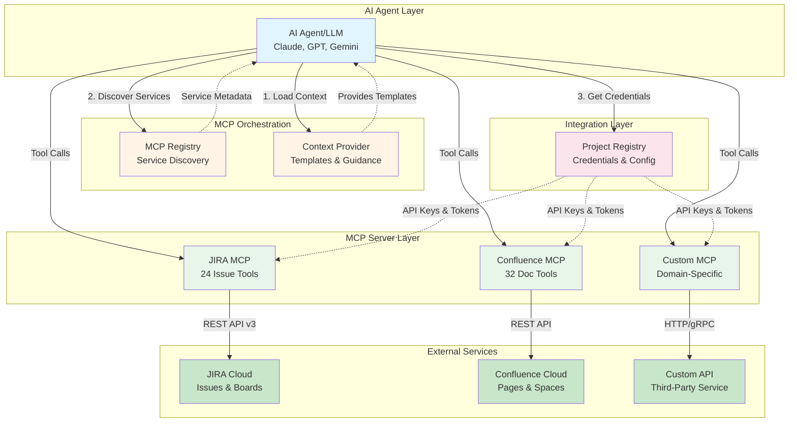
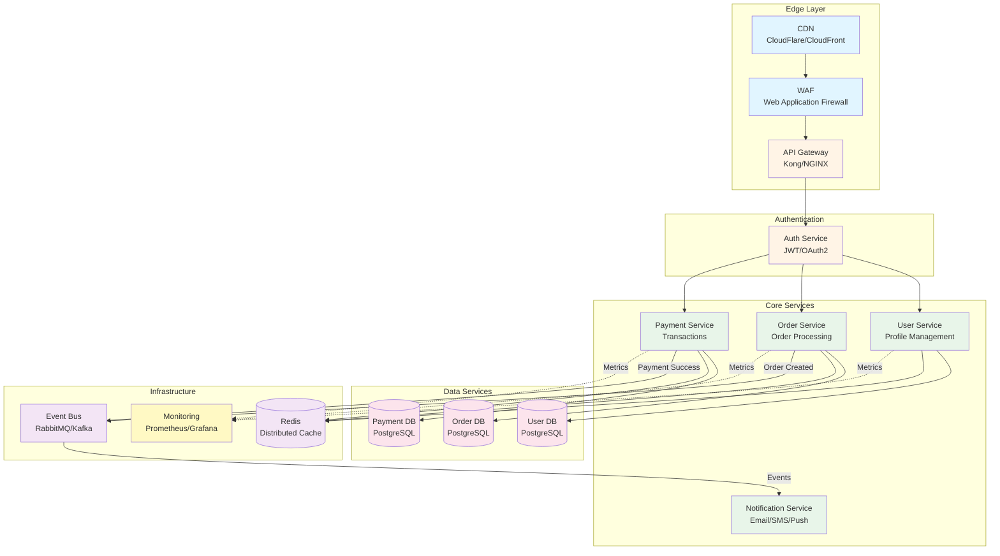
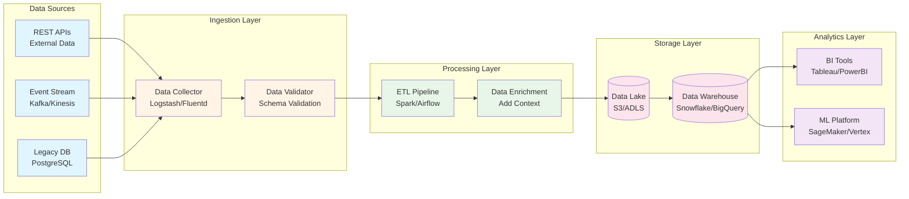
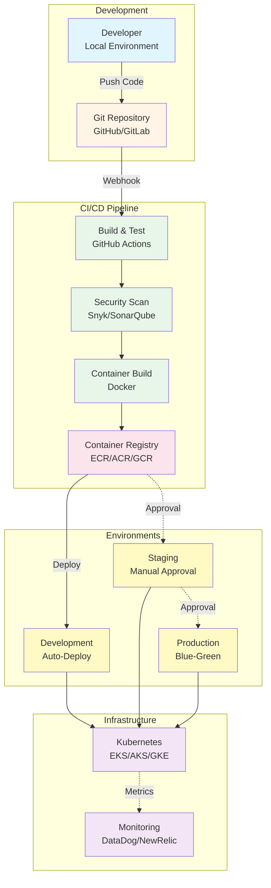
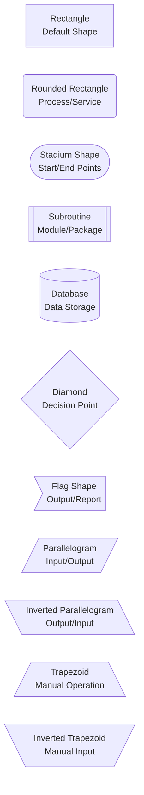
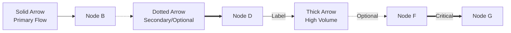

# Architecture Diagrams Template (Mermaid)

**Agent Persona:** Blake (Technical Architect)
**Purpose:** Create high-quality system architecture diagrams using Mermaid for MCP servers, microservices, and distributed systems

## System Architecture Diagram (Recommended)



**Key Design Principles:**

1. **Logical Layering**: Organize components into clear layers (Client, Gateway, Services, Data, External)
2. **Multi-line Labels**: Use `<br/>` to add descriptions: `Service[Service Name<br/>Purpose/Description]`
3. **Subgraph Organization**: Group related components in labeled subgraphs with quotes: `subgraph "Layer Name"`
4. **Arrow Types**:
   - Solid arrows `-->` for primary data flow
   - Dotted arrows `-.->` for optional/external connections
   - Thick arrows `==>` for critical paths
5. **Arrow Labels**: Use `|Label|` to describe relationships: `Service -->|Action| Database`
6. **Color Coding**: Apply consistent colors by layer:
   - Client: Light blue `#e1f5ff`
   - Gateway: Light orange `#fff4e6`
   - Services: Light green `#e8f5e9`
   - Data: Light pink `#fce4ec`
   - External: Light purple `#f3e5f5`

## MCP Server Architecture



**MCP-Specific Guidelines:**

- Show clear separation between AI Agent, MCP layer, and External Services
- Number interaction steps: `|1. Action|`, `|2. Action|`, etc.
- Highlight credential flow from Project Registry to MCPs
- Use lighter colors for external cloud services (`#c8e6c9` vs `#e8f5e9`)
- Show both synchronous (solid) and asynchronous (dotted) connections

## Microservices Architecture



**Microservices Best Practices:**

- Show edge layer (CDN, WAF, Gateway) separately
- Group services by domain/bounded context
- Show database per service (no shared databases)
- Indicate event-driven communication via message bus
- Include cross-cutting concerns (cache, monitoring)
- Use different arrow types for sync vs async communication

## Data Flow Architecture



**Data Pipeline Guidelines:**

- Use left-to-right layout `graph LR` for pipeline flow
- Show clear stages: Ingestion → Processing → Storage → Analytics
- Label each component with technology stack
- Show data transformation points
- Indicate data quality gates (validation, enrichment)

## Deployment Architecture



**Deployment Best Practices:**

- Show complete pipeline from code to production
- Indicate approval gates with dotted arrows `-.->|Approval|`
- Show environment progression (dev → staging → production)
- Include security scanning in pipeline
- Show monitoring/observability layer

## Advanced Styling Techniques

### Node Shape Reference



### Arrow Types and Labels



### Color Palette Guide

Use consistent colors across your architecture diagrams:

```mermaid
graph TB
    Client[Client/User Layer<br/>#e1f5ff Light Blue]
    Gateway[API Gateway Layer<br/>#fff4e6 Light Orange]
    Service[Service Layer<br/>#e8f5e9 Light Green]
    Data[Data Layer<br/>#fce4ec Light Pink]
    External[External Services<br/>#f3e5f5 Light Purple]
    Infra[Infrastructure<br/>#fff9c4 Light Yellow]
    Cloud[Cloud Services<br/>#c8e6c9 Darker Green]

    style Client fill:#e1f5ff
    style Gateway fill:#fff4e6
    style Service fill:#e8f5e9
    style Data fill:#fce4ec
    style External fill:#f3e5f5
    style Infra fill:#fff9c4
    style Cloud fill:#c8e6c9
```



## Template Usage Instructions

### When to Use This Template

Use this template when you need to:
- Document system architecture for MCP servers
- Show microservices architecture and communication patterns
- Visualize data pipelines and ETL workflows
- Document deployment pipelines and infrastructure
- Communicate technical architecture to stakeholders
- Create architecture diagrams for Confluence/JIRA

### How AI Should Populate This Template

1. **Identify Architecture Type:**
   - System architecture → Use layered approach (Client, Gateway, Services, Data)
   - MCP architecture → Show Agent → MCP → External Services flow
   - Microservices → Show service mesh with databases and messaging
   - Data pipeline → Use left-right flow with clear stages
   - Deployment → Show CI/CD pipeline with environments

2. **Apply Design Principles:**
   - Start with logical layers using subgraphs
   - Use multi-line labels with `<br/>` to add context
   - Add technology stack names for clarity
   - Number interaction steps for sequential flows
   - Use consistent color coding by layer type

3. **Choose Arrow Types:**
   - Solid `-->` for primary synchronous calls
   - Dotted `-.->` for optional/asynchronous/secondary flows
   - Thick `==>` for critical/high-volume paths
   - Add labels `|Action|` to describe relationships

4. **Add Styling:**
   - Apply colors consistently across diagram
   - Use same color for similar layer types
   - Make external services visually distinct
   - Highlight critical components with brighter colors

5. **Optimize Layout:**
   - Use `graph TB` (top-bottom) for layered architectures
   - Use `graph LR` (left-right) for pipeline/flow diagrams
   - Keep related components close together in subgraphs
   - Minimize crossing arrows for clarity

### Quality Checklist

Before finalizing the diagram, verify:

- [ ] All components have multi-line labels with descriptions
- [ ] Subgraphs are used to group related components
- [ ] Arrow types correctly represent relationship types
- [ ] Arrow labels clearly describe actions/data flow
- [ ] Consistent color coding applied to all nodes
- [ ] Technology stack names included where relevant
- [ ] Layout direction (TB/LR) appropriate for diagram type
- [ ] No orphaned nodes (all components connected)
- [ ] Critical paths clearly visible
- [ ] External dependencies clearly marked

### Integration with Confluence

After generating the Mermaid diagram:

1. **Test Rendering:**
   - Copy diagram code to https://mermaid.ink
   - Verify layout and styling
   - Adjust as needed for clarity

2. **Generate Image:**
   - Use mermaid.ink API: `https://mermaid.ink/img/{base64_encoded_diagram}`
   - Or use `upload_and_embed_document` tool with base64 PNG

3. **Embed in Confluence:**
   - Use `create_page` tool without spaceKey (auto-fetched)
   - Use `upload_and_embed_document` with:
     - `width: 800` (or larger for complex diagrams)
     - `position: "center"`
     - Auto-embedding handles formatting

### Common Anti-Patterns to Avoid

❌ **Don't:**
- Use single-line labels without context
- Skip subgraph organization
- Use inconsistent colors
- Omit arrow labels
- Create flat diagrams without layers
- Mix TB and LR layouts in same diagram
- Use default styling (always add colors)

✅ **Do:**
- Use multi-line labels with `<br/>`
- Group related components in subgraphs
- Apply consistent color palette
- Label all arrows with actions
- Show clear layering (horizontal or vertical)
- Choose one layout direction and stick with it
- Always add styling for visual clarity

## Mermaid Syntax Reference

### Graph Directions
```markdown
graph TB   # Top to Bottom (vertical layering)
graph BT   # Bottom to Top
graph LR   # Left to Right (pipeline flow)
graph RL   # Right to Left
```

### Subgraph Syntax
```markdown
subgraph "Layer Name"
    Component1[Service A<br/>Description]
    Component2[Service B<br/>Description]
end
```

### Connection Styles
```markdown
A --> B           # Solid arrow
A -.-> B          # Dotted arrow
A ==> B           # Thick arrow
A -->|Label| B    # Labeled arrow
A -.->|Label| B   # Labeled dotted arrow
```

### Node Styling
```markdown
style NodeID fill:#hexcolor
style NodeID fill:#hexcolor,stroke:#hexcolor,stroke-width:2px
```

**Next Step:** After creating architecture diagrams, upload to Confluence using `upload_and_embed_document` tool and link to relevant JIRA epics/stories.
