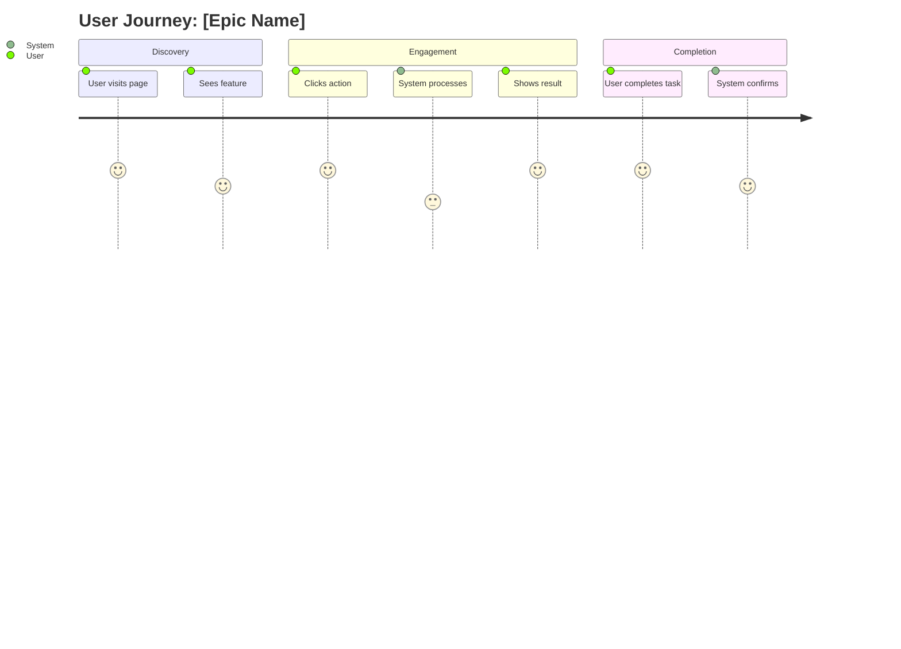
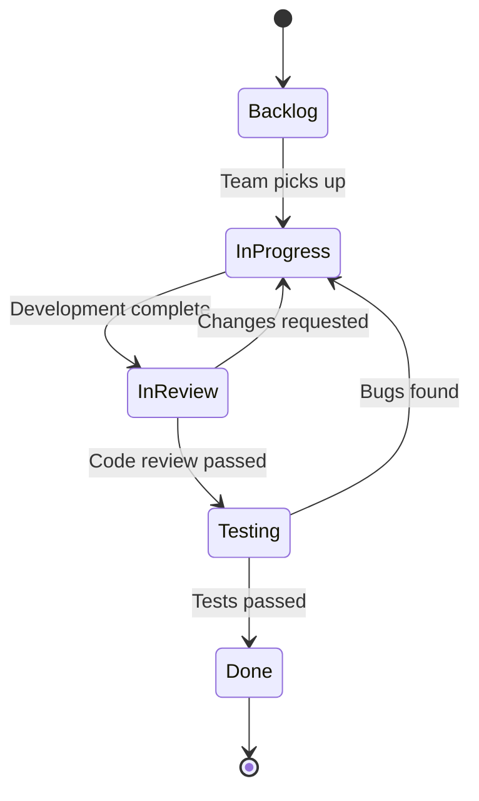

# Epic Specification Template

**Agent Persona:** Alex PM (Product Manager)
Purpose: Create comprehensive epic specifications for VISHKAR Part 1 (Preparation Phase)

## Epic Overview

### Title
[Clear, action-oriented epic title]

### Business Objective
[Why are we building this? What business value does it deliver?]

### Success Metrics
- [ ] Metric 1 (e.g., "Reduce onboarding time by 50%")
- [ ] Metric 2
- [ ] Metric 3

## User Stories Overview

### Target Users
- **Primary:** [Who is the main user?]
- **Secondary:** [Who else benefits?]

### High-Level User Stories
1. As a [user type], I want to [action], so that [benefit]
2. As a [user type], I want to [action], so that [benefit]
3. As a [user type], I want to [action], so that [benefit]

## User Journey Flow Diagram

- Map each user interaction step
- Rate satisfaction (1-5) for each step (1=worst, 5=best)
- Include system actions that support user goals
- Highlight pain points (low scores <3) for improvement
- Add sections for logical grouping of journey phases

## Acceptance Criteria

### Must Have (P0)
- [ ] Criterion 1
- [ ] Criterion 2

### Should Have (P1)
- [ ] Criterion 1
- [ ] Criterion 2

### Nice to Have (P2)
- [ ] Criterion 1
- [ ] Criterion 2

## Dependencies

### Technical Dependencies
- [ ] Dependency 1 (e.g., "API authentication service must be deployed")
- [ ] Dependency 2

### Business Dependencies
- [ ] Dependency 1 (e.g., "Legal approval for data handling")
- [ ] Dependency 2

### Team Dependencies
- [ ] Dependency 1 (e.g., "Design team to finalize UI mockups")
- [ ] Dependency 2

## Scope

### In Scope
- Feature 1
- Feature 2
- Feature 3

### Out of Scope
- Feature X (reason: will be addressed in future epic)
- Feature Y (reason: not aligned with current business goals)

## Constraints & Assumptions

### Constraints
- Technical: [e.g., "Must work with existing PostgreSQL database"]
- Business: [e.g., "Must launch before Q2 2025"]
- Regulatory: [e.g., "Must comply with GDPR"]

### Assumptions
- [e.g., "Users have stable internet connection"]
- [e.g., "Third-party API will maintain 99.9% uptime"]

## Risk Assessment

| Risk | Impact | Probability | Mitigation |
|------|--------|-------------|------------|
| [Risk description] | High/Med/Low | High/Med/Low | [Mitigation strategy] |

## Integration Points

### Systems/Services
- System 1: [Description of integration]
- System 2: [Description of integration]

### APIs
- API 1: [Purpose and endpoints]
- API 2: [Purpose and endpoints]

## Epic State Diagram

- Define all epic states (align with JIRA workflow)
- Show transitions between states with labels
- Include rollback paths for failures/changes
- Add notes for complex transitions
- Ensure states match your SDLC process

## JIRA Structure

### Epic
- Epic Name: [EPIC-XXX]
- Project: [VISHKAR]
- Labels: [phase-1, preparation, architecture]

### Child Stories (High-Level)
1. Story 1 title
2. Story 2 title
3. Story 3 title

## Review Checklist

- [ ] Business objective clearly defined
- [ ] Success metrics are measurable
- [ ] Acceptance criteria are testable
- [ ] Dependencies identified and documented
- [ ] Risks assessed with mitigation plans
- [ ] Scope clearly defined (in/out)
- [ ] Integration points documented
- [ ] Human approval gate checkpoints defined

## Notes

[Additional context, references, or considerations]

**Next Step:** After epic approval, Blake (Architect) creates technical architecture document.
