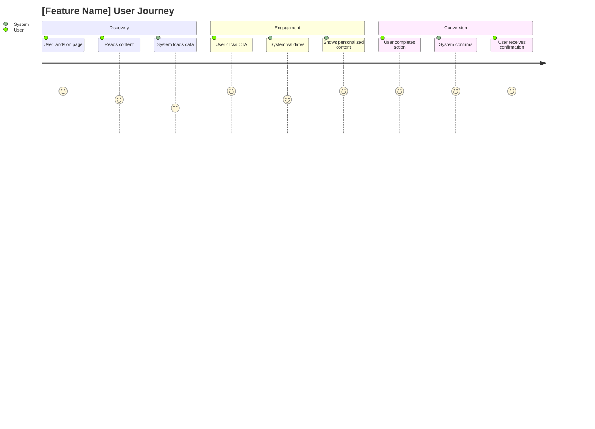
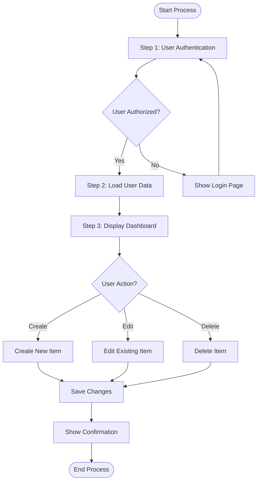
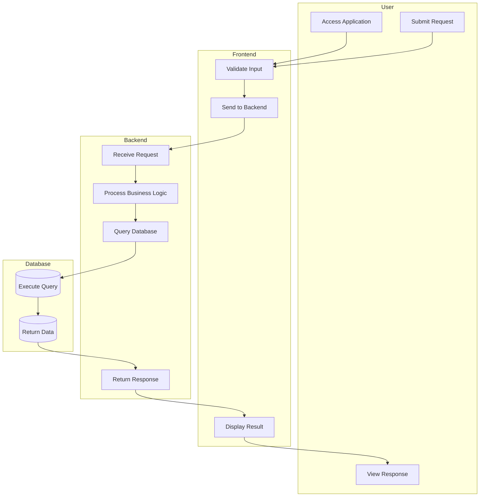
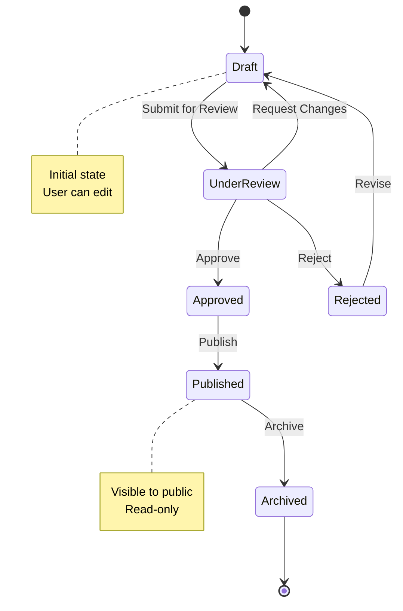
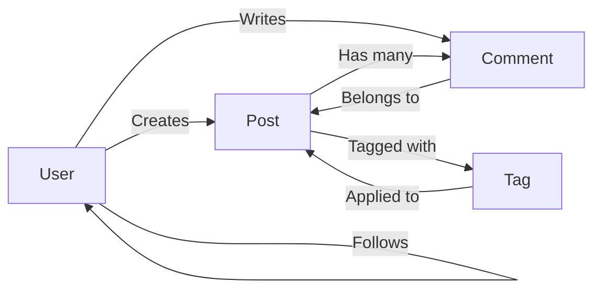
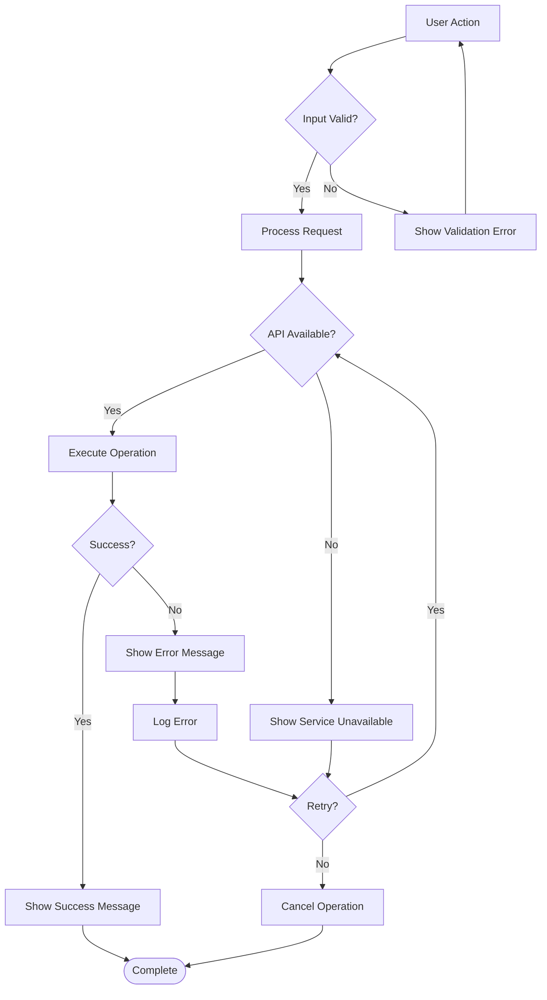
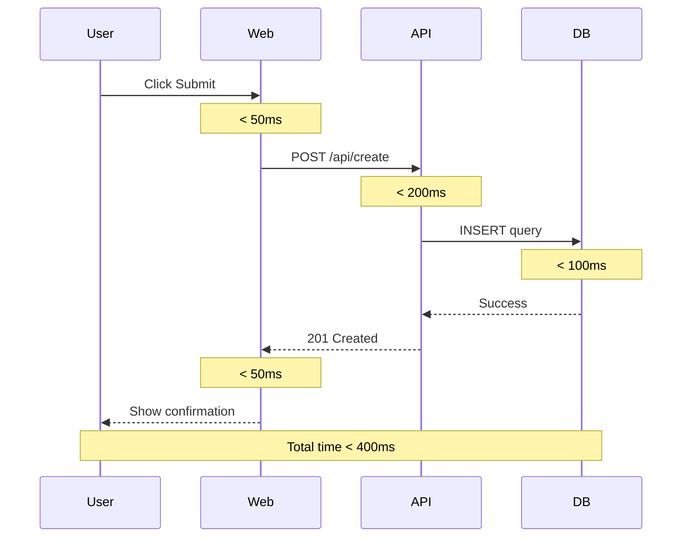
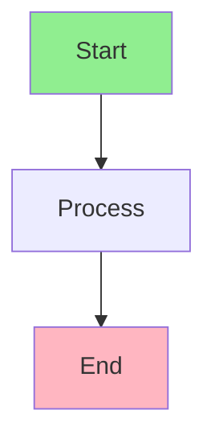

# Flow Diagrams Template

**Agent Persona:** Blake (Technical Architect) / Business Analyst
Purpose: Document user flows, system processes, and data flows for VISHKAR projects

## User Journey Flow



- Rate each step from 1-5 (1=poor experience, 5=excellent experience)
- Include both user actions and system responses
- Group steps into logical sections (phases of journey)
- Highlight pain points with low scores (<3)
- Use sections to show progression through feature

## Process Flow Diagram



- Use clear, descriptive step labels
- Show all decision points with `{}`
- Include start `([Start])` and end `([End])` nodes
- Use `-->` for flow direction
- Add labels on decision branches (`|Yes|`, `|No|`)
- Show loops where processes repeat

## Swimlane Diagram (Cross-Functional Process)



- Use subgraphs for each actor/system
- Label subgraphs with role/system name
- Show interactions across boundaries
- Include all touchpoints between actors
- Use emojis for visual clarity (optional)

## State Machine Diagram



- Define all possible states
- Show transitions with action labels
- Include notes for state descriptions
- Show entry `[*]` and exit states
- Include rollback paths for failures

## Entity Relationship Flow



- Show entity relationships
- Use emojis for entity types
- Label relationships with verbs
- Show cardinality (one-to-many, many-to-many)
- Include all key entities

## Error Handling Flow



- Show happy path and error paths
- Include retry logic
- Show error logging/reporting
- Include user feedback at each error
- Show recovery options

## Timing Diagram (Sequence with Time Constraints)



- Add time constraints using `Note over`
- Show performance targets
- Include total duration
- Highlight time-critical sections
- Use for performance planning

## Template Usage Instructions

### When to Use This Template

Use this template when you need to:
- Document user journeys and experiences
- Map business processes
- Show system interactions
- Define state transitions
- Document error handling flows
- Show timing and performance requirements

### How AI Should Populate This Template

1. **Analyze Requirements:** Understand the feature/process being documented
2. **Choose Appropriate Diagram:** Select the diagram type that best represents the flow
3. **Map All Steps:** Include all user actions, system responses, and decisions
4. **Show Alternatives:** Include error paths, edge cases, and alternatives
5. **Add Context:** Use notes and labels to clarify complex points
6. **Validate Completeness:** Ensure all scenarios are covered

### Diagram Selection Guide

| Use Case | Recommended Diagram |
|----------|-------------------|
| User experience mapping | User Journey Flow |
| Business process | Process Flow Diagram |
| Cross-team workflow | Swimlane Diagram |
| Object lifecycle | State Machine Diagram |
| Data relationships | Entity Relationship Flow |
| Error scenarios | Error Handling Flow |
| Performance planning | Timing Diagram |

## Mermaid Syntax Quick Reference

### Common Elements

```markdown
- Nodes: `A[Rectangle]`, `B(Rounded)`, `C{Decision}`, `D([Stadium])`
- Connections: `-->` (arrow), `-.->` (dotted), `==>` (thick)
- Labels: `A -->|Label| B`
- Subgraphs: `subgraph Name ... end`
```

### Styling (Optional)



**Next Step:** After creating flow diagrams, integrate into appropriate documentation (Confluence, JIRA, technical specs).
