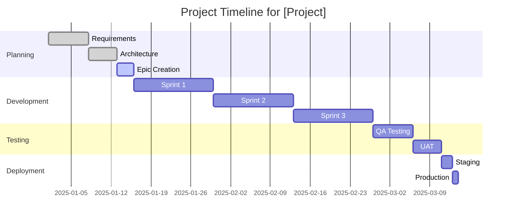
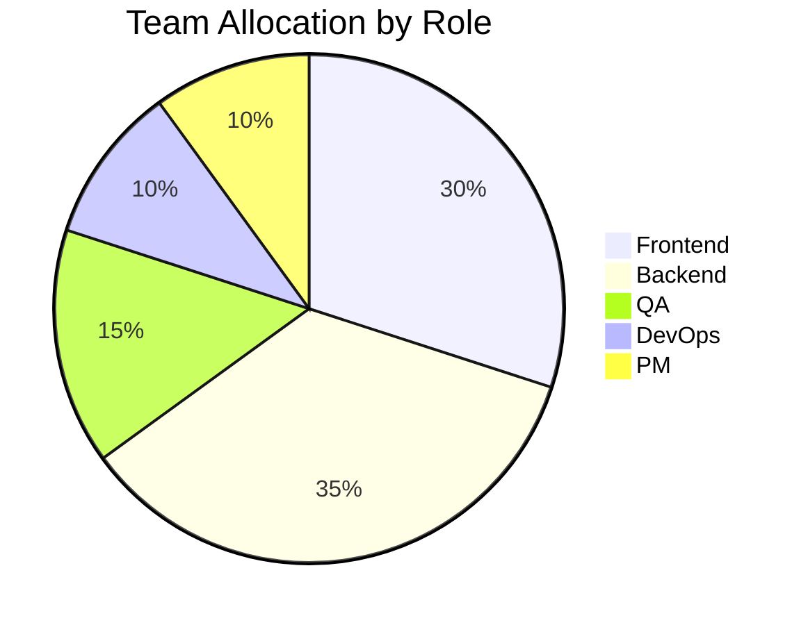
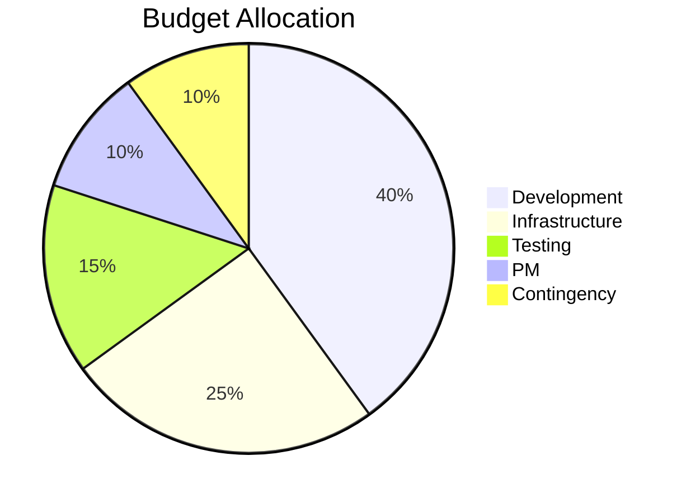

# Project Plan Template

**Agent:** Casey PM (Project Manager)
**Purpose:** Timeline, estimates, resource plans for VISHKAR Preparation

## Project Overview

**Project:** [Feature/Epic name]

**Goals:**
1. Goal 1
2. Goal 2
3. Goal 3

**Scope:** [Brief summary from Epic]

## Timeline

**Duration:**
- Start: YYYY-MM-DD
- End: YYYY-MM-DD
- Total: [X weeks/months]

**Milestones:**
| Milestone | Target Date | Dependencies | Status |
|-----------|-------------|--------------|--------|
| Foundation | YYYY-MM-DD | None | Not Started |
| Core Features | YYYY-MM-DD | Milestone 1 | Not Started |
| Integration | YYYY-MM-DD | Milestone 2 | Not Started |
| Testing | YYYY-MM-DD | Milestone 3 | Not Started |
| Launch | YYYY-MM-DD | Milestone 4 | Not Started |

### Gantt Chart

## Work Breakdown

**Epic:** [EPIC-XXX] [Name]

### Story 1: [STORY-XXX] [Title]
- **Estimate:** [Points/Hours]
- **Assignee:** [TBA by Business Analyst]
- **Sprint:** [Number]
- **Dependencies:** [None/STORY-YYY]
- **Tasks:**
  - [ ] Task 1 (2h)
  - [ ] Task 2 (4h)
  - [ ] Task 3 (3h)

## Effort Estimation

### By Component
| Component | Stories | Story Points | Hours | Confidence |
|-----------|---------|--------------|-------|------------|
| Frontend | 5 | 21 | 84h | High |
| Backend API | 8 | 34 | 136h | Medium |
| Database | 3 | 13 | 52h | High |
| Testing | 4 | 13 | 52h | Medium |
| DevOps | 2 | 8 | 32h | High |
| **Total** | **22** | **89** | **356h** | - |

### By Sprint
| Sprint | Stories | Points | Capacity | Utilization |
|--------|---------|--------|----------|-------------|
| Sprint 1 | 5 | 21 | 40h | 53% |
| Sprint 2 | 6 | 26 | 40h | 65% |
| Sprint 3 | 5 | 21 | 40h | 53% |
| Sprint 4 | 6 | 21 | 40h | 53% |
| **Total** | **22** | **89** | **160h** | **56%** |

## Resource Plan

### Team Allocation

### Team Structure

**Core Team:**
- Product Manager: Alex PM (10%)
- Technical Architect: Blake (25%)
- Project Manager: Casey PM (15%)
- Developers:
  - Developer 1: [Name] (100%)
  - Developer 2: [Name] (100%)
  - Developer 3: [Name] (50%)
- QA Engineer: [Name] (100%)
- DevOps Engineer: [Name] (25%)

**Stakeholders:**
- Business Owner: [Name]
- Key Users: [Names]

## Budget

**Budget Allocation:**

**Cost Breakdown:**
| Category | Estimated Cost |
|----------|----------------|
| Development | $40,000 |
| Infrastructure | $25,000 |
| Testing | $15,000 |
| Management | $10,000 |
| Contingency | $10,000 |
| **Total** | **$100,000** |

## Dependencies

**Internal:**
- Authentication service (ready)
- Database schema (in progress)
- Shared components (ready)

**External:**
- Third-party API access (pending)
- Cloud infrastructure (ready)
- Monitoring tools (ready)

## Risks

| Risk | Impact | Probability | Mitigation | Owner |
|------|--------|-------------|------------|-------|
| Requirements change | High | Medium | Change control process | PM |
| Key resource unavailable | High | Low | Cross-training, backup | PM |
| Technical complexity | Medium | High | Proof of concept, spike | Architect |
| Integration delays | Medium | Medium | Early integration testing | Tech Lead |
| Third-party API issues | High | Medium | Fallback plan, retry logic | Architect |

## Communication Plan

**Daily:**
- Stand-up (15 min, 9:00 AM)
- Slack updates as needed

**Weekly:**
- Sprint planning (Mon, 2h)
- Sprint review (Fri, 1h)
- Sprint retro (Fri, 30min)

**Bi-weekly:**
- Stakeholder demo
- Status report to leadership

**Ad-hoc:**
- Technical spikes
- Architecture reviews
- Risk discussions

## Quality Gates

**Sprint Level:**
- [ ] All stories meet acceptance criteria
- [ ] Code review completed
- [ ] Unit tests pass (>90% coverage)
- [ ] Integration tests pass
- [ ] No critical bugs

**Release Level:**
- [ ] All E2E tests pass
- [ ] Performance targets met
- [ ] Security review completed
- [ ] Documentation updated
- [ ] UAT sign-off received

## Success Metrics

**Project Metrics:**
- On-time delivery
- Within budget
- <5% scope creep

**Quality Metrics:**
- >90% test coverage
- <0.1% production error rate
- <200ms response time (p95)

**Team Metrics:**
- Velocity: [Target points/sprint]
- Sprint commitment: >90%
- Team satisfaction: >8/10

## Assumptions

1. Team has necessary skills
2. Infrastructure available as planned
3. Third-party APIs stable
4. No major requirement changes
5. Test environments ready

## Constraints

1. Fixed deadline: [Date]
2. Budget cap: [$Amount]
3. Team size: [Number] developers
4. Technology stack: [Technologies]
5. Compliance requirements: [Standards]

## Sign-off

- [ ] Project plan reviewed by team
- [ ] Approved by stakeholders
- [ ] Resource commitments confirmed
- [ ] Budget approved
- [ ] Kick-off meeting scheduled
