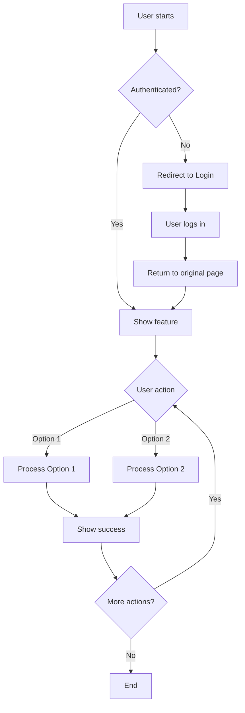
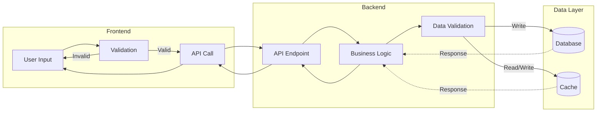

# Story Breakdown Template

**Agent Persona:** Business Analyst
Purpose: Break epics into detailed user stories for VISHKAR Part 2 (SDLC Execution)

## Parent Epic

**Epic:** [EPIC-XXX] [Epic Name]
**Link:** [JIRA link to epic]

## Story Details

### Story Title
[STORY-XXX]: As a [user type], I want to [action], so that [benefit]

### Description
[Detailed description of what needs to be built]

**Context:**
[Why is this story needed? What problem does it solve?]

**User Perspective:**
[How will the user interact with this feature?]

## User Flow Diagram

- Show all decision points in the user journey
- Include authentication/authorization checks
- Map error handling paths
- Show loops for repeated actions
- Use descriptive labels for each step
- Include all user interaction points

## Data Flow Diagram

- Show data transformation at each layer
- Include validation points
- Show both read and write paths
- Include caching strategy if applicable
- Use solid lines for main flow, dashed for responses
- Label data formats at each step

## Acceptance Criteria

### Functional Requirements
- [ ] Given [precondition], when [action], then [expected result]
- [ ] Given [precondition], when [action], then [expected result]
- [ ] Given [precondition], when [action], then [expected result]

### Non-Functional Requirements
- [ ] Performance: [e.g., "Response time < 200ms"]
- [ ] Security: [e.g., "Requires authentication"]
- [ ] Accessibility: [e.g., "WCAG 2.1 AA compliant"]
- [ ] Browser Support: [e.g., "Chrome, Firefox, Safari latest versions"]

## Technical Details

### Affected Components
- [ ] Frontend: [Specific pages/components]
- [ ] Backend: [Specific APIs/services]
- [ ] Database: [Schema changes required]
- [ ] Infrastructure: [Configuration changes]

### API Endpoints (if applicable)
- **POST** `/api/resource` - [Purpose]
- **GET** `/api/resource/{id}` - [Purpose]
- **PUT** `/api/resource/{id}` - [Purpose]
- **DELETE** `/api/resource/{id}` - [Purpose]

### Database Changes (if applicable)
- [ ] New table: [table_name]
- [ ] Schema migration: [Description]
- [ ] Index creation: [Details]

## Dependencies

### Blocked By
- [ ] STORY-XXX: [Story title] - [Reason]

### Blocks
- [ ] STORY-YYY: [Story title] - [Reason]

### Related Stories
- STORY-ZZZ: [Relationship description]

## Tasks Breakdown

### Backend Tasks
- [ ] Task 1: Set up database migration (2h)
- [ ] Task 2: Implement API endpoint (4h)
- [ ] Task 3: Add validation logic (2h)
- [ ] Task 4: Write unit tests (3h)
- [ ] Task 5: Integration tests (2h)

### Frontend Tasks
- [ ] Task 1: Create UI components (4h)
- [ ] Task 2: Integrate API calls (2h)
- [ ] Task 3: Add error handling (2h)
- [ ] Task 4: Write component tests (2h)

### Testing Tasks
- [ ] Task 1: Create test cases in Kiwi TCMS (1h)
- [ ] Task 2: Write E2E tests (4h)
- [ ] Task 3: Manual testing (2h)

**Total Estimate:** [X hours / Y story points]

## Test Strategy

### Unit Tests
- **Coverage Target:** >90%
- **Focus Areas:**
  - Business logic validation
  - Error handling
  - Edge cases

### Integration Tests
- **Scope:**
  - API contract validation
  - Database interactions
  - Third-party integrations

### E2E Tests (Playwright)
- **Scenarios:**
  1. Happy path: [Description]
  2. Error path: [Description]
  3. Edge case: [Description]

### Manual Testing
- [ ] Test on Chrome, Firefox, Safari
- [ ] Test mobile responsive design
- [ ] Test accessibility (screen reader)

## Definition of Done

### Code Quality
- [ ] Code reviewed and approved (2 reviewers)
- [ ] No linter errors
- [ ] No security vulnerabilities (high/critical)
- [ ] Code follows project conventions

### Testing
- [ ] Unit tests passing (>90% coverage)
- [ ] Integration tests passing
- [ ] E2E tests passing
- [ ] Manual testing completed
- [ ] Test cases documented in Kiwi TCMS

### Documentation
- [ ] API documentation updated
- [ ] Code comments added for complex logic
- [ ] Confluence page updated (if needed)
- [ ] README updated (if needed)

### SDLC Steps
- [ ] Manual verification completed
- [ ] Kiwi TCMS test cases created
- [ ] Automated tests implemented
- [ ] Local testing passed
- [ ] PR created and reviewed (3-phase MCP)
- [ ] CI/CD checks passing
- [ ] Human approval for merge

## Risk Assessment

| Risk | Impact | Mitigation |
|------|--------|------------|
| [Risk description] | High/Med/Low | [Mitigation strategy] |

## Subtasks (Created in JIRA)

- [ ] Subtask 1: [Description] (Assignee: Developer)
- [ ] Subtask 2: [Description] (Assignee: Developer)
- [ ] Subtask 3: [Description] (Assignee: QA)

## Notes

[Additional context, references, design mockups, etc.]

## JIRA Metadata

**Project:** VISHKAR
**Epic Link:** EPIC-XXX
**Story Points:** [Fibonacci: 1, 2, 3, 5, 8, 13]
**Sprint:** Sprint X
**Assignee:** [To be assigned by Developer agent]
**Labels:** `story`, `backend`, `frontend`, `testing`
**Priority:** High/Medium/Low

**Next Step:** Developer agent picks story and begins implementation following 13-step SDLC.
