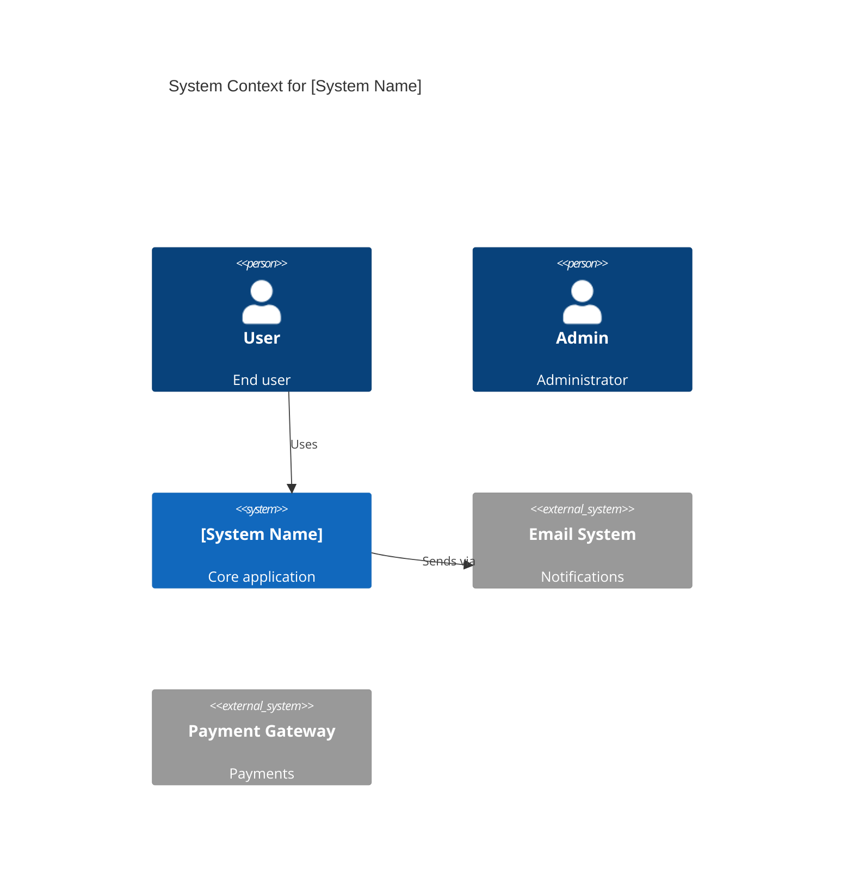
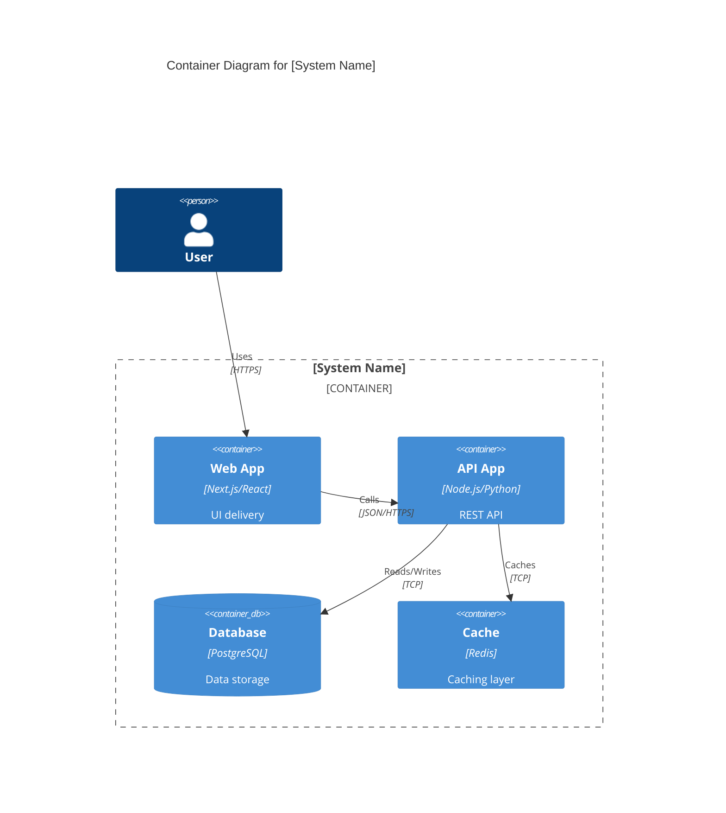
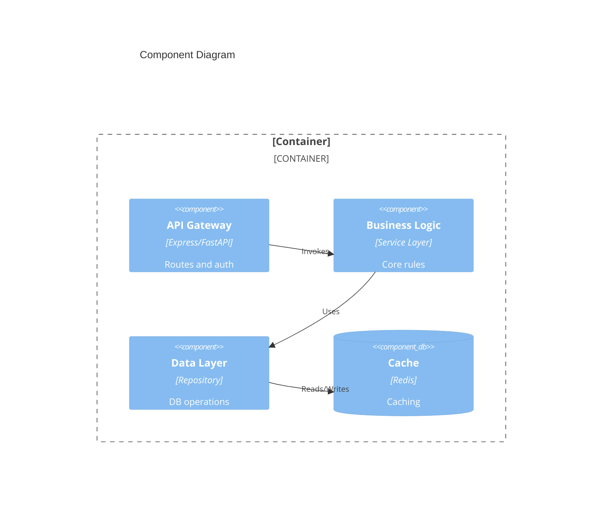
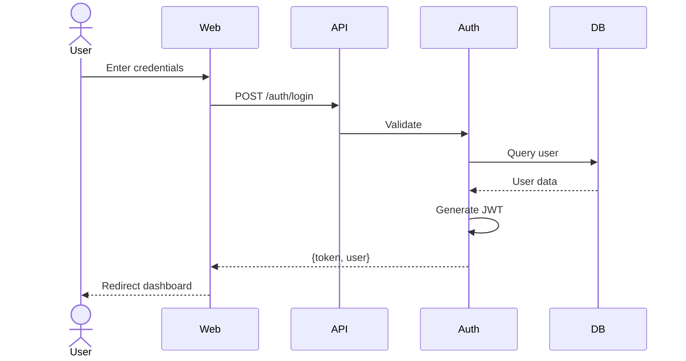
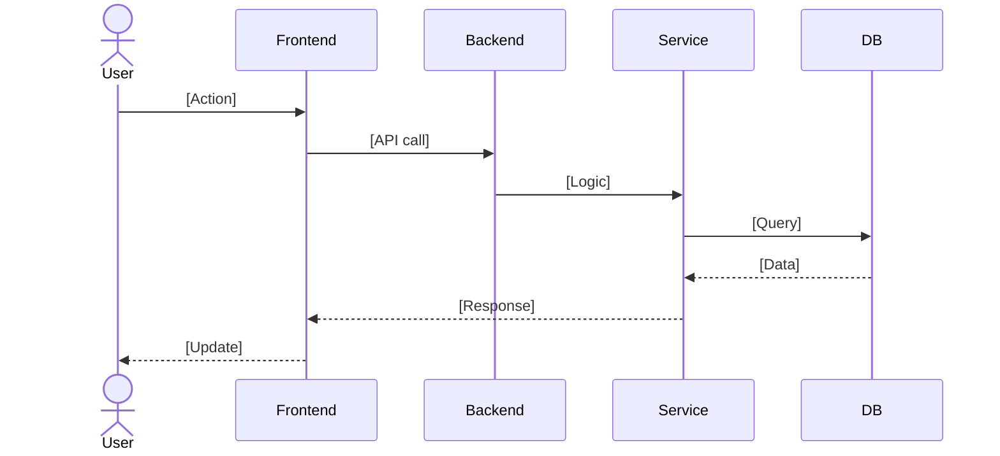
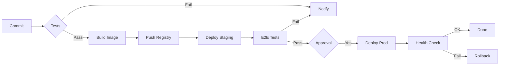
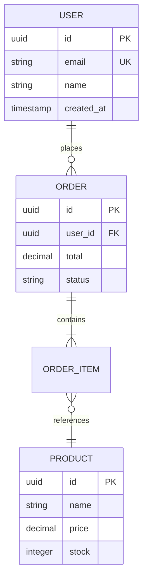
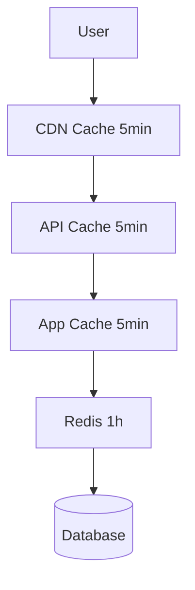

# Technical Architecture Template

**Agent:** Blake (Technical Architect)
**Purpose:** Design system architecture and define tech stack

## Architecture Overview

### System Name
[Feature/System name]

### Architecture Pattern
[e.g., Microservices, Event-Driven, Layered]

### System Context Diagram (C4 Level 1)



### Container Diagram (C4 Level 2)



## Tech Stack Selection

### Frontend
- **Framework:** [React/Vue/Angular]
- **Version:** [Specific version]
- **Rationale:** [Why this choice]
- **Key Libraries:** [List main dependencies]

### Backend
- **Framework:** [.NET/Node.js/Python]
- **Version:** [Specific version]
- **Rationale:** [Why this choice]

### Database
- **Type:** [PostgreSQL/MongoDB/Redis]
- **Version:** [Specific version]
- **Schema Strategy:** [Normalization, indexing]

### Infrastructure
- **Hosting:** [AWS/Azure/GCP]
- **Containerization:** [Docker/Kubernetes]
- **CI/CD:** [GitHub Actions/Jenkins]
- **Monitoring:** [Prometheus/Grafana/Sentry]

## Component Diagram (C4 Level 3)



### Component Design

**Component: [Name]**
- **Purpose:** [Brief description]
- **Responsibilities:** [Key tasks]
- **Interfaces:** Input/Output formats
- **Technology:** [Tech with version]
- **Dependencies:** [Required services]
- **Error Handling:** [Strategy]

## API Design

### API Architecture
- **Style:** REST/GraphQL/gRPC
- **Base URL:** `https://api.example.com/v1`
- **Authentication:** JWT/OAuth2/API Key
- **Rate Limiting:** [Limits]
- **Versioning:** URL/Header based

### Endpoint: POST /api/v1/resource

**Request:**
```json
{
  "field1": "string",
  "field2": 123,
  "nested": { "field3": true }
}
```

**Response (201 Created):**
```json
{
  "id": "uuid-v4",
  "field1": "string",
  "created_at": "2025-10-10T10:30:00Z"
}
```

**Error Responses:**
- **400:** Validation error
- **401:** Unauthorized
- **404:** Not found
- **429:** Rate limit exceeded

### Error Code Reference

| Code | Status | Description | Retry? |
|------|--------|-------------|--------|
| VALIDATION_ERROR | 400 | Invalid input | No |
| UNAUTHORIZED | 401 | Auth required | No |
| RESOURCE_NOT_FOUND | 404 | Not found | No |
| RATE_LIMIT_EXCEEDED | 429 | Too many requests | Yes |
| INTERNAL_ERROR | 500 | Server error | Yes |

## Key Flow Diagrams

### User Authentication Flow



### [Feature] Flow



## Infrastructure Architecture

### Deployment Diagram

```python
# Infrastructure as Code (Diagrams library)
from diagrams import Diagram, Cluster
from diagrams.aws.compute import ECS, Lambda
from diagrams.aws.database import RDS, ElastiCache
from diagrams.aws.network import ELB, CloudFront

with Diagram("[Project] Infrastructure", show=False):
    cdn = CloudFront("CDN")
    lb = ELB("Load Balancer")
    
    with Cluster("Application"):
        web = [ECS("Web 1"), ECS("Web 2"), ECS("Web 3")]
    
    with Cluster("Data"):
        db = RDS("PostgreSQL")
        cache = ElastiCache("Redis")
    
    cdn >> lb >> web >> db
    web >> cache
```

### Deployment Pipeline



## Data Architecture

### Data Model



### Database Schema

```sql
CREATE TABLE entity_name (
  id UUID PRIMARY KEY DEFAULT gen_random_uuid(),
  field1 VARCHAR(255) NOT NULL,
  field2 INTEGER CHECK (field2 >= 0),
  field3 JSONB,
  status VARCHAR(50) DEFAULT 'active',
  created_at TIMESTAMP WITH TIME ZONE DEFAULT NOW(),
  updated_at TIMESTAMP WITH TIME ZONE DEFAULT NOW()
);

CREATE INDEX idx_entity_field1 ON entity_name(field1);
CREATE INDEX idx_entity_status ON entity_name(status) WHERE deleted_at IS NULL;
CREATE INDEX idx_entity_jsonb ON entity_name USING GIN (field3);
```

**Relationships:**
- One-to-Many: Entity1 → Entity2
- Many-to-Many: Entity1 ↔ Entity3 (via join table)

**Index Strategy:**
- Primary: UUID for distributed systems
- Unique: Business key
- Filter: Active records only
- JSONB: GIN index for JSON queries

**Partitioning:**
- By: created_at (monthly)
- Retention: 12 months, archive older

### Caching Strategy

**Layers:**
1. **CDN Cache:** Static assets (24h TTL)
2. **Application Cache:** In-memory (5min TTL)
3. **Redis:** Distributed (1h TTL)

**Patterns:**
- Cache-Aside: Read from cache, populate on miss
- Write-Through: Write to cache and DB simultaneously

**Keys:**
```
entity:{id}
entity:list:{filter}:{page}
entity:search:{query}
```

**Invalidation:**
- CREATE: Invalidate list caches
- UPDATE: Invalidate entity + list caches
- DELETE: Invalidate entity + list caches

## Security Considerations

### Authentication
- **Method:** JWT/OAuth2/Session
- **Token Expiry:** [Duration]

### Authorization
- **Model:** RBAC/ABAC
- **Roles:** Admin, User, Guest

### Data Protection
- Encryption at rest (AES-256)
- Encryption in transit (TLS 1.3)
- PII handling (GDPR/CCPA compliance)

### API Security
- Rate limiting (100 req/min)
- CORS configuration
- Input validation
- SQL injection prevention (parameterized queries)

## Integration Points

### Integration: [External Service]

**Type:** REST API

**Authentication:**
- Method: OAuth 2.0 / API Key
- Credentials: AWS Secrets Manager
- Token refresh: Automatic

**Endpoints:**
```
POST https://api.external.com/v1/resource
GET https://api.external.com/v1/resource/{id}
```

**Error Handling:**
- **Timeout:** 10s, retry 3x with exponential backoff
- **Rate Limit:** 100 req/min
- **Circuit Breaker:** Open after 5 failures, half-open after 30s
- **Fallback:** Cached data or defaults

**Retry Logic:**
```typescript
async function callAPI(payload, retries = 3) {
  for (let attempt = 1; attempt <= retries; attempt++) {
    try {
      const response = await fetch(url, { 
        method: 'POST',
        body: JSON.stringify(payload),
        timeout: 10000
      });
      if (response.ok) return response.json();
      if (response.status === 429) {
        await sleep(Math.pow(2, attempt) * 1000);
        continue;
      }
      throw new Error(`API error: ${response.status}`);
    } catch (error) {
      if (attempt === retries) throw error;
      await sleep(Math.pow(2, attempt) * 1000);
    }
  }
}
```

### Webhook Integration

**Endpoint:** `POST /api/webhooks/partner`

**Security:**
- HMAC signature verification
- IP whitelist
- Rate limiting: 1000/hour

**Processing:**
1. Receive request
2. Verify signature
3. Acknowledge (200 OK)
4. Queue for async processing
5. Process in background
6. Idempotency via event_id

## Performance Strategy

### Requirements

**Response Times:**
- Read operations: <200ms (p95)
- Write operations: <500ms (p95)
- Search: <1000ms (p95)

**Throughput:**
- Normal: 1,000 RPS
- Peak: 5,000 RPS
- Concurrent users: 10,000

### Multi-Layer Caching



### Database Optimization

**Query Optimization:**
- Appropriate indexes on all tables
- EXPLAIN ANALYZE for slow queries (>100ms)
- Read replicas for read-heavy ops

**Connection Pooling:**
```typescript
const pool = new Pool({
  max: 100,
  min: 10,
  idleTimeoutMillis: 30000,
  connectionTimeoutMillis: 5000
});
```

**Read Replicas:**
- Master: Writes only
- Replicas 1-3: Reads (load balanced)
- Alert if replication lag > 1s

### Horizontal Scaling

**Auto-Scaling (Kubernetes HPA):**
```yaml
apiVersion: autoscaling/v2
kind: HorizontalPodAutoscaler
metadata:
  name: api-autoscaler
spec:
  scaleTargetRef:
    kind: Deployment
    name: api
  minReplicas: 3
  maxReplicas: 20
  metrics:
  - type: Resource
    resource:
      name: cpu
      target:
        type: Utilization
        averageUtilization: 70
```

### Performance Testing

```bash
# k6 load test
import http from 'k6/http';
import { check } from 'k6';

export let options = {
  stages: [
    { duration: '2m', target: 100 },
    { duration: '5m', target: 100 },
    { duration: '2m', target: 0 }
  ],
  thresholds: {
    http_req_duration: ['p(95)<500'],
    http_req_failed: ['rate<0.01']
  }
};

export default function() {
  let res = http.get('https://api.example.com/v1/products');
  check(res, { 'status 200': (r) => r.status === 200 });
}
```

## Monitoring & Observability

### Metrics
- **Application:** Response time, error rate, throughput
- **Infrastructure:** CPU, memory, disk
- **Business:** User signups, transactions

### Logging
- **Levels:** INFO, WARN, ERROR
- **Aggregation:** ELK/CloudWatch
- **Retention:** 30 days

### Alerting
- Error rate > 5%
- Response time > 1s (p95)
- CPU > 80%
- Memory > 85%

## Technical Risks

| Risk | Impact | Probability | Mitigation | Owner | Status |
|------|--------|-------------|------------|-------|--------|
| Third-party API failure | High | Medium | Circuit breaker, fallback, redundant providers | Backend | Active |
| DB connection exhaustion | High | Low | Connection pooling, monitoring, auto-scaling | DevOps | Active |
| Query performance degradation | High | Medium | Indexes, read replicas, caching, monitoring | Backend | Active |
| Horizontal scaling limits | Medium | High | Auto-scaling, load testing, capacity planning | DevOps | Active |
| SQL injection | High | Low | Parameterized queries, ORM, input validation | Backend | Active |

**Top 3 Critical Risks:**

1. **Database Query Performance**
   - Mitigation: Comprehensive indexing, 3 read replicas, Redis caching (1h TTL), pg_stat_statements monitoring
   - Timeline: Week 1-2
   - Success: All queries <100ms (p95)

2. **Traffic Spike Handling**
   - Mitigation: Kubernetes HPA (3-20 pods), load testing (5000 RPS), CDN caching
   - Timeline: Week 2-3
   - Success: Handle 5000 RPS with <500ms response

3. **Monitoring Gaps**
   - Mitigation: Full observability stack, 20+ alerts, runbooks, on-call rotation
   - Timeline: Week 1-2
   - Success: MTTD <5min, MTTR <30min

## Development Estimates

| Component | Dev Effort | Test Effort | Total |
|-----------|------------|-------------|-------|
| Auth & Authorization | 8-10 days | 3-5 days | 13-17 days |
| API Layer | 12-15 days | 5-7 days | 20-25 days |
| Database Layer | 10-12 days | 4-5 days | 16-19 days |
| Caching | 6-8 days | 3-4 days | 10-13 days |
| External Integrations | 15-18 days | 6-8 days | 24-29 days |
| Monitoring | 8-10 days | 3-4 days | 13-16 days |
| Security | 10-12 days | 5-6 days | 17-20 days |
| Performance | 8-10 days | 4-5 days | 14-17 days |
| **TOTAL** | **82-101 days** | **34-46 days** | **133-164 days** |

**With 3 Developers + 1 QA:** 8-11 weeks (parallel)
**With Buffers:** 10-14 weeks

## Review Checklist

### Architecture
- [ ] System Context Diagram (C4 L1)
- [ ] Container Diagram (C4 L2)
- [ ] Component Diagram (C4 L3)
- [ ] Architecture pattern appropriate
- [ ] Tech stack validated

### Data & API
- [ ] ER diagram complete
- [ ] Database schema defined
- [ ] All indexes documented
- [ ] Caching strategy defined
- [ ] All API endpoints documented
- [ ] Error codes defined
- [ ] Authentication specified

### Integration & Performance
- [ ] Integration architecture diagram
- [ ] All integrations documented
- [ ] Error handling defined
- [ ] Performance requirements set
- [ ] Caching strategy complete
- [ ] Scaling configuration ready

### Risk & Security
- [ ] All risks identified
- [ ] Mitigation strategies defined
- [ ] Security measures addressed
- [ ] Monitoring strategy complete

### Sign-off
- [ ] Architecture reviewed by Senior Architect
- [ ] Security review completed
- [ ] Estimates reviewed by Tech Lead

## Next Steps

**Confluence Page:** [Link to detailed architecture documentation]
**Next:** Casey PM creates project plan with timeline and resources
